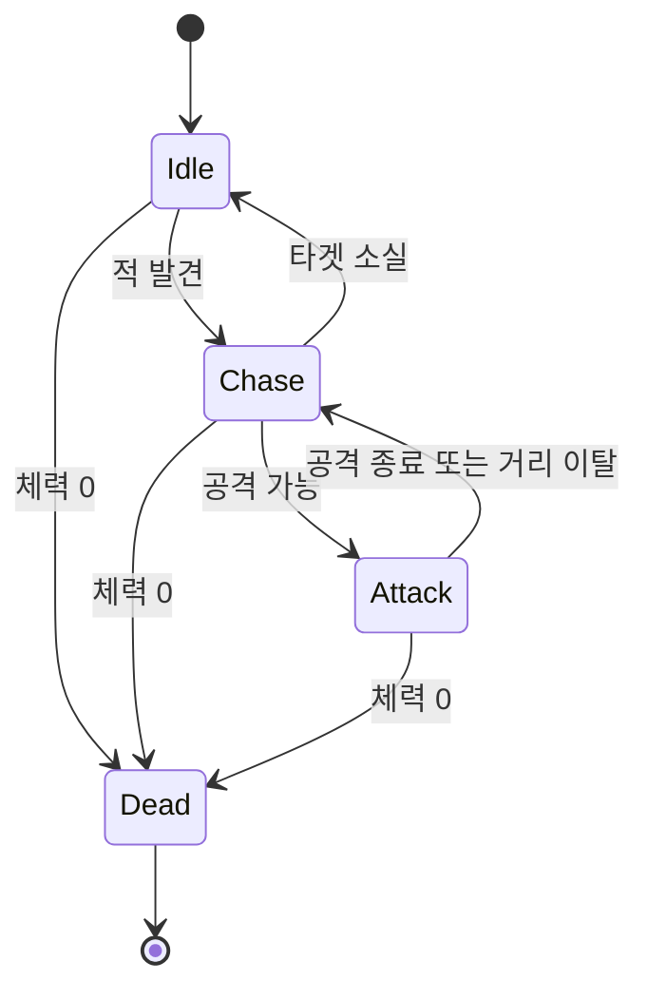
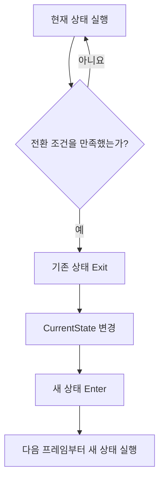
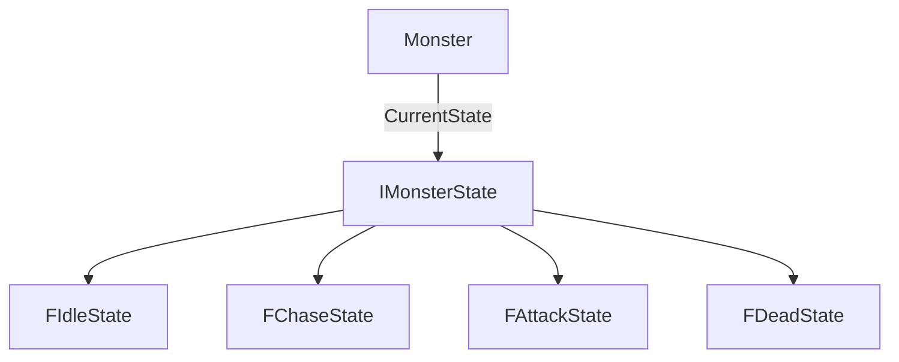
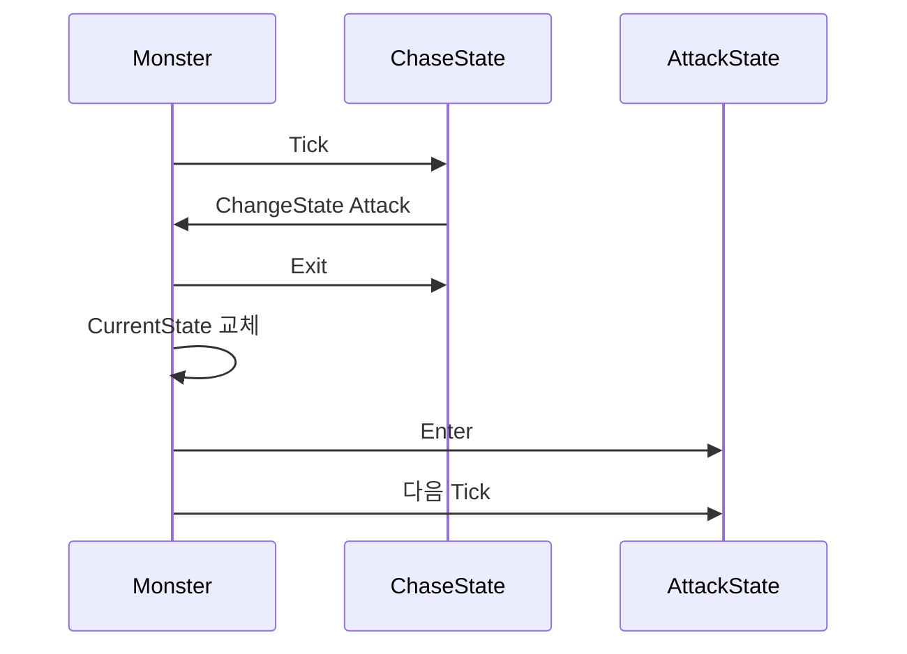

# FSM과 State Pattern

<a id="contents"></a>

## 목차

1. [FSM이란?](#fsm)
2. [상태와 전이](#states-and-transitions)
3. [enum과 switch로 만드는 FSM](#switch-fsm)
4. [상태 변경과 생명주기](#lifecycle)
5. [switch 방식이 커질 때](#switch-limitations)
6. [State Pattern](#state-pattern)
7. [State 구현과 Context](#state-context)
8. [State가 변경되는 과정](#transition-flow)
9. [FSM과 State Pattern의 차이](#difference)
10. [어떤 방식을 선택할까?](#selection)
11. [Unreal Engine의 StateTree](#state-tree)
12. [정리](#summary)

---

아래 코드는 구조를 설명하기 위해 선언과 초기화 일부를 생략한 예시다. FSM을 구현하는 방법은 하나가 아니며, 상태 수와 각 상태의 복잡도에 맞는 구조를 선택하는 것이 중요하다.

---

<a id="fsm"></a>

## 1. FSM이란?

FSM은 Finite State Machine, 유한 상태 머신의 약자다.

객체가 정해진 상태 중 현재 하나의 상태를 가지고 있고, 조건이나 사건에 따라 다른 상태로 전환되는 구조다.

몬스터 AI라면 다음처럼 표현할 수 있다.



FSM을 이해할 때는 세 가지를 먼저 구분하면 된다.

| 구분 | 의미 | 예시 |
| --- | --- | --- |
| State | 현재 객체가 놓인 상태 | `Chase` |
| Transition | 한 상태에서 다른 상태로 변경되는 과정 | `Chase → Attack` |
| Condition / Event | 전이가 일어나는 조건이나 사건 | `CanAttack() == true` |

현재 상태가 `Chase`이고 `CanAttack()`이 참이 되면 `Attack`으로 바뀌는 식이다.

---

<a id="states-and-transitions"></a>

## 2. 상태와 전이

상태는 단순한 이름만 의미하지 않는다. 해당 상태에서 실행할 행동과 상태에 들어오고 나갈 때의 처리도 함께 생각해야 한다.

예를 들어 `Attack` 상태는 다음 책임을 가질 수 있다.

```text
Enter
공격 몽타주를 시작한다.

Tick
타겟을 바라보고 공격 시점을 확인한다.

Exit
공격과 관련된 임시 상태를 정리한다.
```

전이는 상태 사이에 연결된 조건이다.

```text
Chase
  │
  │ CanAttack() == true
  ▼
Attack
```

전환 조건이 여기저기 흩어지면 현재 상태가 언제 바뀌는지 찾기 어려워진다. 상태 변경을 한 함수로 모으면 Exit와 Enter의 호출 순서도 일관되게 유지할 수 있다.

---

<a id="switch-fsm"></a>

## 3. enum과 switch로 만드는 FSM

FSM은 특정 디자인 패턴의 이름이 아니다. 상태가 적다면 `enum`, 현재 상태 변수, `switch`만으로도 충분히 만들 수 있다.

### 상태 정의

```cpp
enum class EMonsterState
{
    Idle,
    Chase,
    Attack,
    Dead
};
```

```cpp
EMonsterState CurrentState = EMonsterState::Idle;
```

### 현재 상태 실행

```cpp
void AMonster::Tick(float DeltaTime)
{
    Super::Tick(DeltaTime);

    switch (CurrentState)
    {
    case EMonsterState::Idle:
        TickIdle(DeltaTime);
        break;

    case EMonsterState::Chase:
        TickChase(DeltaTime);
        break;

    case EMonsterState::Attack:
        TickAttack(DeltaTime);
        break;

    case EMonsterState::Dead:
        break;
    }
}
```

`Tick()`은 현재 상태에 해당하는 로직만 실행한다.

```cpp
void AMonster::TickChase(float DeltaTime)
{
    MoveToEnemy(DeltaTime);

    if (CanAttack())
    {
        ChangeState(EMonsterState::Attack);
    }
}
```

구조가 작을 때는 한 클래스 안에서 전체 상태와 전환을 확인할 수 있다는 점이 장점이다.

---

<a id="lifecycle"></a>

## 4. 상태 변경과 생명주기

상태 변경은 기존 상태를 정리하고 새 상태를 시작하는 과정까지 포함한다.

```cpp
void AMonster::ChangeState(EMonsterState NewState)
{
    if (CurrentState == NewState)
    {
        return;
    }

    ExitState(CurrentState);
    CurrentState = NewState;
    EnterState(CurrentState);
}
```

전체 순서는 다음과 같다.



`EnterState()`에서는 상태에 처음 들어왔을 때 한 번만 필요한 작업을 처리한다.

```cpp
void AMonster::EnterState(EMonsterState State)
{
    switch (State)
    {
    case EMonsterState::Idle:
        StopMovement();
        break;

    case EMonsterState::Chase:
        StartChasing();
        break;

    case EMonsterState::Attack:
        PlayAttackMontage();
        break;

    case EMonsterState::Dead:
        HandleDeath();
        break;
    }
}
```

매 프레임 필요한 로직과 진입할 때 한 번 필요한 로직을 나누면 같은 초기화가 반복되는 일을 줄일 수 있다.

---

<a id="switch-limitations"></a>

## 5. switch 방식이 커질 때

상태가 적고 로직도 짧다면 `enum + switch`가 가장 단순하다. 문제는 상태와 각 상태의 행동이 함께 커질 때 생긴다.

```text
Idle
Chase
Attack
Skill
Stun
Knockback
Dead
```

한 클래스 안에 다음 코드가 계속 쌓이게 된다.

```text
EnterIdle / TickIdle / ExitIdle
EnterChase / TickChase / ExitChase
EnterAttack / TickAttack / ExitAttack
EnterStun / TickStun / ExitStun
...
```

몬스터의 공통 데이터와 상태별 행동, 전환 조건이 한곳에 모이면 클래스가 커지고 수정 범위도 파악하기 어려워진다.

그렇다고 `switch`가 보이면 바로 State Pattern으로 바꿀 필요는 없다. 상태가 몇 개 없고 로직이 단순한데 클래스를 여러 개로 나누면 오히려 흐름을 따라가기 어려울 수 있다.

---

<a id="state-pattern"></a>

## 6. State Pattern

State Pattern은 상태별 행동을 별도 객체로 분리하는 디자인 패턴이다.

기존에는 몬스터가 현재 상태를 확인하고 직접 분기했다.

```cpp
switch (CurrentState)
{
case EMonsterState::Idle:
    TickIdle(DeltaTime);
    break;

case EMonsterState::Chase:
    TickChase(DeltaTime);
    break;
}
```

State Pattern을 적용하면 몬스터는 현재 State에 실행을 맡긴다.

```cpp
CurrentState->Tick(*this, DeltaTime);
```

상태 객체는 공통 Interface를 구현한다.

```cpp
class IMonsterState
{
public:
    virtual ~IMonsterState() = default;

    virtual void Enter(AMonster& Owner) = 0;
    virtual void Tick(AMonster& Owner, float DeltaTime) = 0;
    virtual void Exit(AMonster& Owner) = 0;
};
```

구조는 다음처럼 바뀐다.



몬스터는 상태를 실행하고 교체하는 흐름을 담당하고, 각 State는 자신의 행동을 담당한다.

---

<a id="state-context"></a>

## 7. State 구현과 Context

`Chase`에 관련된 코드는 `FChaseState` 안으로 모을 수 있다.

```cpp
class FChaseState : public IMonsterState
{
public:
    void Enter(AMonster& Owner) override
    {
        Owner.StartChasing();
    }

    void Tick(AMonster& Owner, float DeltaTime) override
    {
        if (!Owner.GetTarget())
        {
            Owner.ChangeState(EMonsterState::Idle);
            return;
        }

        Owner.MoveToEnemy(DeltaTime);

        if (Owner.CanAttack())
        {
            Owner.ChangeState(EMonsterState::Attack);
        }
    }

    void Exit(AMonster& Owner) override
    {
        Owner.StopMovement();
    }
};
```

State가 HP나 Target 같은 데이터를 모두 복사해서 가질 필요는 없다. 필요한 데이터는 Owner나 별도의 Context를 통해 가져올 수 있다.

```text
Monster / Context
├─ HP
├─ Target
└─ AttackRange
       ▲
       │ 조회
   ChaseState
```

State 객체가 상태 실행 중에만 필요한 타이머나 단계 값을 가진다면 인스턴스의 소유 범위도 분명해야 한다. 여러 몬스터가 하나의 State 객체를 공유하면서 그 안에 개별 몬스터의 실행 데이터를 저장하면 서로의 값이 섞일 수 있다.

State가 Owner의 모든 public 함수에 자유롭게 접근하기 시작하면 큰 클래스를 작은 파일로만 나눈 결과가 될 수도 있다. State에 필요한 Context를 좁게 제공하거나, 실제 기능은 Movement나 Combat Component에 맡기는 방법도 함께 생각할 수 있다.

---

<a id="transition-flow"></a>

## 8. State가 변경되는 과정

State Pattern에서도 전환 순서는 기존 FSM과 같다.

```cpp
void AMonster::ChangeState(EMonsterState NewState)
{
    IMonsterState* NextState = FindState(NewState);

    if (!NextState || NextState == CurrentState)
    {
        return;
    }

    if (CurrentState)
    {
        CurrentState->Exit(*this);
    }

    CurrentState = NextState;
    CurrentStateType = NewState;
    CurrentState->Enter(*this);
}
```

현재 상태가 `Chase`이고 공격이 가능해졌다면 다음 흐름으로 전환된다.



실제 구현에서는 `FindState()`가 반환하는 객체의 수명과 소유권을 Monster가 보장해야 한다. 전환 도중 다시 상태를 바꾸는 재진입이 가능한 구조라면 전환 요청을 모아 안전한 시점에 처리할지도 정해야 한다.

---

<a id="difference"></a>

## 9. FSM과 State Pattern의 차이

FSM과 State Pattern은 같은 개념이 아니다.

```text
FSM
상태와 상태 전환을 관리하는 구조

State Pattern
상태별 행동을 객체로 나누는 디자인 패턴
```

FSM은 `enum + switch`로도 만들 수 있고 State Pattern으로도 만들 수 있다. 프로젝트에 따라 데이터 중심 테이블이나 Unreal의 StateTree 같은 시스템을 사용할 수도 있다.

즉 State Pattern은 FSM을 구현하는 방법 중 하나다.

---

<a id="selection"></a>

## 10. 어떤 방식을 선택할까?

| 기준 | enum + switch | State Pattern |
| --- | --- | --- |
| 상태 수 | 적을 때 편함 | 많아질수록 분리에 유리 |
| 상태별 로직 | 짧고 단순함 | Enter, Tick, Exit가 큼 |
| 코드 위치 | 한 클래스에서 전체 확인 | 상태별 클래스로 분리 |
| 확장 비용 | 분기와 함수가 함께 증가 | State를 추가해 확장 |
| 추적 난이도 | 작은 구조에서 낮음 | 파일 이동이 늘 수 있음 |
| 객체 관리 | 별도 State 객체 없음 | State의 생성과 수명 관리 필요 |

처음부터 State Pattern을 적용할 필요는 없다.


작은 FSM은 단순하게 시작하고, 상태별 책임을 분리할 필요가 생겼을 때 구조를 바꾸는 편이 이해하기 쉽다.

---

<a id="state-tree"></a>

## 11. Unreal Engine의 StateTree

StateTree는 Unreal Engine이 제공하는 범용 계층형 상태 머신이다. Behavior Tree의 Selector 개념과 상태 머신의 State, Transition을 함께 사용한다.

StateTree에서는 상태를 트리 구조로 구성하고 다음 요소를 이용해 동작을 만든다.

| 요소 | 역할 |
| --- | --- |
| State | 현재 활성화할 상태와 계층 구성 |
| Enter Condition | 해당 State를 선택할 수 있는지 판단 |
| Task | State가 활성화된 동안 실행할 작업 |
| Transition | 완료, 조건, Event 등에 따라 다음 선택 시작 |
| Evaluator | State와 Transition에서 사용할 외부 데이터 제공 |

부모에서 자식까지 선택된 State가 함께 활성화되고, 활성 State의 Task들이 실행된다. State의 계층과 공통 전환, 데이터 바인딩, Editor 작업 흐름이 필요하다면 직접 FSM을 크게 만드는 것보다 StateTree가 더 잘 맞을 수 있다.

StateTree의 선택과 실행 방식은 [Unreal Engine StateTree 개요](https://dev.epicgames.com/documentation/en-us/unreal-engine/overview-of-state-tree-in-unreal-engine)에서 확인할 수 있다.

직접 만든 State Pattern과 StateTree는 구조와 실행 규칙이 같지 않다. 기존 State 클래스를 그대로 StateTree Task로 옮길 수 있다고 가정하기보다, StateTree의 State 선택과 Task 완료 규칙에 맞게 다시 나누는 편이 안전하다.

---

<a id="summary"></a>

## 12. 정리

```text
FSM
현재 상태를 실행하고
조건이나 Event에 따라 다른 상태로 전환한다.

enum + switch
상태가 적고 로직이 단순할 때 이해하기 쉽다.

State Pattern
상태별 행동을 별도 객체로 분리한다.

StateTree
계층적인 State와 Transition, Task가 필요한 경우 검토한다.
```

FSM에서 중요한 것은 어떤 패턴을 사용했는지가 아니다. 현재 상태와 전환 조건을 쉽게 찾을 수 있고, 상태가 바뀔 때 Enter와 Exit가 예측 가능한 순서로 실행되며, 복잡도가 커져도 각 상태의 책임을 관리할 수 있어야 한다.

현재 문제를 해결할 수 있는 가장 단순한 구조로 시작하고, 상태 수와 상태별 로직이 실제로 커질 때 다음 단계의 구조를 선택하는 것이 좋다.

---

[목차로 돌아가기](#contents) · [메인 README의 CS 목차로 돌아가기](../../README.md#cs)
