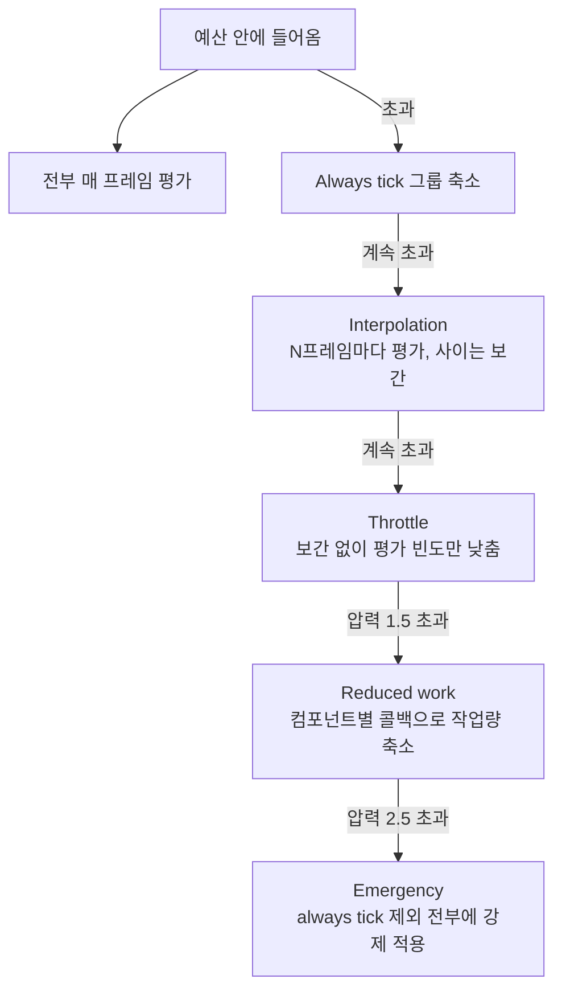
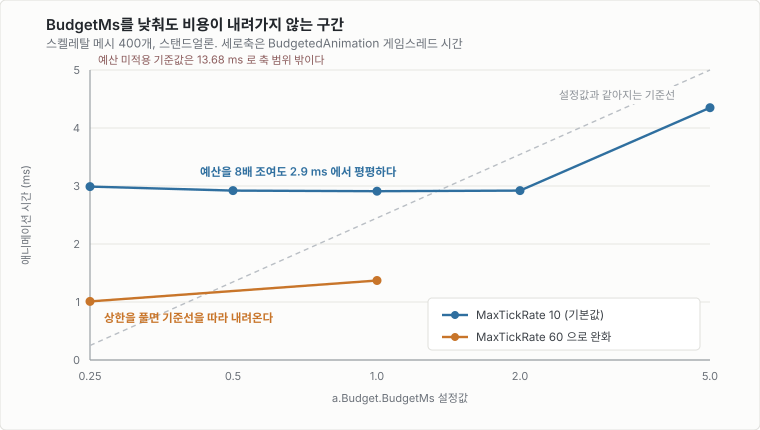
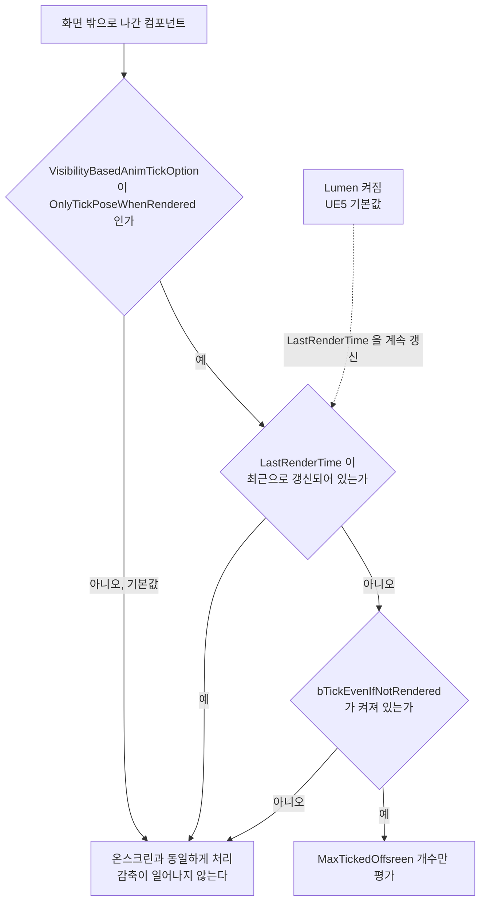
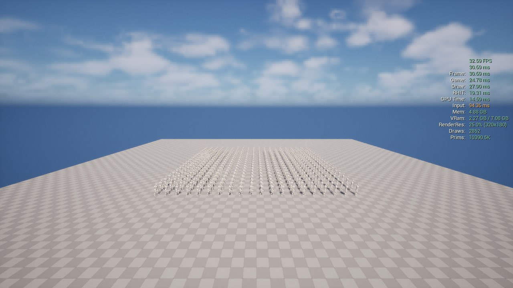
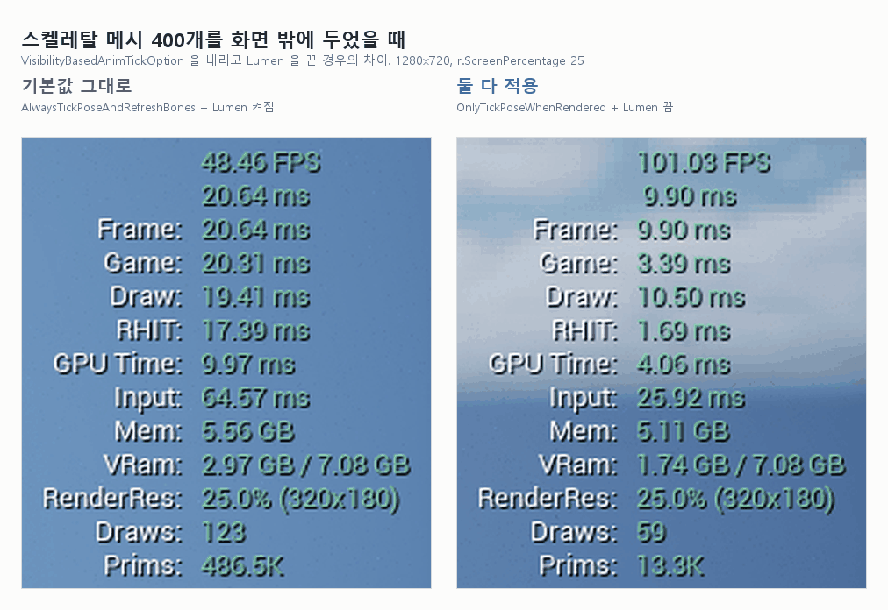
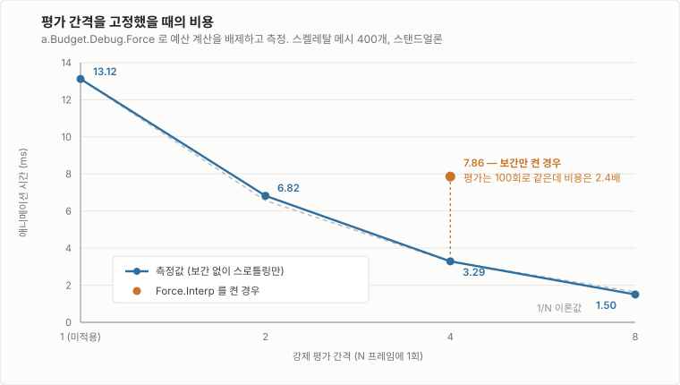

# Animation Budget Allocator로 애니메이션 비용 묶기

<a id="contents"></a>

## 목차

1. [무엇을 하는 플러그인인가](#what)
2. [준비 - 플러그인과 모듈](#setup)
3. [부하를 줄이는 다섯 단계](#tiers)
4. [켜는 데 스위치가 두 개다](#enable)
5. [측정 환경 만들기](#harness)
6. [무엇으로 재는가](#metrics)
7. [기본값으로 얼마나 줄어드는가](#baseline)
8. [BudgetMs가 듣지 않는 구간](#plateau)
9. [Significance는 순위로 배분된다](#significance)
10. [Reduced work는 델리게이트가 없으면 죽어 있다](#reducedwork)
11. [화면 밖 처리에는 조건이 두 겹 있다](#offscreen)
12. [보간은 공짜가 아니다](#interpolation)
13. [보간 파라미터가 듣는 구간](#interp-tuning)
14. [막히기 쉬운 곳](#pitfalls)
15. [정리](#summary)

---

이 문서는 Unreal Engine 5.8 기준이다. 테스트 코드는 `Source/UnrealEngineLab/AnimBudget/`, 측정 스크립트는 `Scripts/AnimBudget/` 에 있다. 설명을 위해 일부 선언은 생략했다.

플러그인 동작에 대한 설명은 엔진 소스(`Engine/Plugins/Runtime/AnimationBudgetAllocator/`)를 직접 읽고 확인했다. 수치는 전부 i9-10900F / RTX 3070에서 스켈레탈 메시 400개를 띄워 실제로 측정한 값이다.

---

<a id="what"></a>

## 1. 무엇을 하는 플러그인인가

스켈레탈 메시가 많아지면 애니메이션 평가가 게임 스레드를 먹는다. 메시 수에 거의 비례해서 늘어나기 때문에, 군중이나 대규모 전투처럼 수백 개가 동시에 보이는 장면에서 먼저 터진다.

Animation Budget Allocator는 여기에 **시간 상한을 걸고, 그 안에서 틱을 재분배한다.** 메시가 늘어도 프레임 시간이 같이 늘어나는 대신, 예산을 넘는 순간부터 중요도가 낮은 메시의 평가 빈도를 떨어뜨린다. 느려지는 대신 덜 정확해지는 쪽을 택하는 것이다.

400개를 띄워 놓고 기본값만 켰을 때 이렇게 바뀐다.

| | 애니메이션 시간 | 게임 스레드 | 매 프레임 평가된 메시 |
| --- | --- | --- | --- |
| 미적용 | 13.68 ms | 23.01 ms | 400 / 400 |
| BudgetMs 1.0 | 2.91 ms | 7.11 ms | 84 / 400 |

플러그인은 엔진에 들어 있지만 기본으로 꺼져 있다(`EnabledByDefault: false`). 모듈 로딩 페이즈는 `PreDefault` 다.

---

<a id="setup"></a>

## 2. 준비 - 플러그인과 모듈

플러그인을 켠다.

```json
{
    "Name": "AnimationBudgetAllocator",
    "Enabled": true
}
```

C++에서 만지려면 모듈 의존성도 추가한다.

```csharp
PrivateDependencyModuleNames.AddRange(new string[] { "AnimationBudgetAllocator" });
```

여기까지는 흔한 절차인데, 하나가 더 있다. **대상 컴포넌트가 `USkeletalMeshComponentBudgeted` 여야 한다.** 일반 `USkeletalMeshComponent` 는 이 시스템이 쳐다보지도 않는다. 플러그인이 제공하는 파생 클래스로 교체해야 하고, `BlueprintSpawnableComponent` 라서 블루프린트에서도 컴포넌트로 붙일 수 있다.

교체하면 등록은 알아서 된다. `bAutoRegisterWithBudgetAllocator` 가 기본 `true` 라서 `BeginPlay` 에서 스스로 등록한다. 데디케이티드 서버에서는 등록하지 않는다.

등록되는 순간 컴포넌트에 이런 일이 벌어진다는 점은 알아 둘 필요가 있다.

```cpp
InComponent->bEnableUpdateRateOptimizations = false;
InComponent->EnableExternalTickRateControl(true);
```

URO(Update Rate Optimization)가 강제로 꺼진다. 두 시스템은 같이 쓸 수 없고, allocator를 끄면 원래대로 돌아온다. URO 기반 최적화와 성능을 비교하려면 시나리오를 아예 나눠서 재야 한다.

---

<a id="tiers"></a>

## 3. 부하를 줄이는 다섯 단계

예산을 넘으면 한 번에 다 깎는 게 아니라 단계적으로 내려간다.



각 단계를 조절하는 값은 이렇게 나뉜다.

| 단계 | 동작 | 관련 파라미터 |
| --- | --- | --- |
| Always tick | 매 프레임 풀 평가 | `AlwaysTickFalloffAggression` |
| Interpolation | N프레임마다 평가하고 사이는 포즈 보간 | `InterpolationFalloffAggression`, `InterpolationMaxRate`, `MaxInterpolatedComponents` |
| Throttle | 보간 없이 평가 빈도만 낮춤. 포즈가 계단식으로 끊긴다 | `MaxTickRate`, `MinQuality` |
| Reduced work | 콜백으로 작업량 자체를 줄인다 | `BudgetFactorBeforeReducedWork` |
| Emergency | `bAlwaysTick` 이 아닌 전부에 위를 강제 적용 | `BudgetPressureBeforeEmergencyReducedWork` |

자주 만지게 되는 CVar만 추리면 이 정도다.

| CVar | 기본값 | 설명 |
| --- | --- | --- |
| `a.Budget.Enabled` | 0 | 전역 스위치. 이것만으로는 켜지지 않는다([4절](#enable)) |
| `a.Budget.BudgetMs` | 1.0 | 스켈레탈 메시 작업에 줄 시간 |
| `a.Budget.MaxTickRate` | 10 | 최대 평가 간격. 품질 하한이자 예산의 실질적 한계([8절](#plateau)) |
| `a.Budget.MinQuality` | 0.0 | 최소 품질. 0이 아니면 예산을 넘길 수 있다 |
| `a.Budget.InterpolationMaxRate` | 6 | 보간 중 최대 평가 간격 |
| `a.Budget.MaxInterpolatedComponents` | 16 | 이름과 달리 상한이 아니다([13절](#interp-tuning)) |
| `a.Budget.InterpolationTickMultiplier` | 0.75 | 보간 틱의 상대 비용 추정치 |
| `a.Budget.MaxTickedOffsreen` | 4 | 화면 밖에서 평가할 최대 개수. 엔진 오타 그대로다 |
| `a.Budget.Debug.Enabled` | 0 | 화면 디버그 표시 |
| `a.Budget.Debug.Force` | 0 | 예산 계산을 배제하고 값 고정([12절](#interpolation)) |

`a.Budget.MaxTickedOffsreen` 은 오타가 아니라 엔진에 그렇게 등록되어 있다. `Offscreen` 으로 치면 아무 일도 일어나지 않는다.

---

<a id="enable"></a>

## 4. 켜는 데 스위치가 두 개다

가장 먼저 막히는 지점이다. 콘솔에 `a.Budget.Enabled 1` 만 쳐서는 **아무 일도 일어나지 않는다.**

```cpp
// AnimationBudgetAllocator.cpp
const bool bUpdatingThisTick = FAnimationBudgetAllocator::bCachedEnabled && bEnabled;
```

두 값이 AND로 묶여 있다.

```text
bCachedEnabled   전역 CVar a.Budget.Enabled 를 따라간다
bEnabled         월드마다 하나씩 있는 플래그. 기본값이 false 다
```

뒤엣것은 CVar로 켤 수 없다. 둘 중 하나를 써야 한다.

```cpp
// C++
IAnimationBudgetAllocator::Get(World)->SetEnabled(true);
```

블루프린트라면 `Enable Animation Budget` 노드가 같은 일을 한다.

여기에 하나가 더 붙는다. allocator는 **게임 월드에만 만들어진다.**

```cpp
if (Budgeter == nullptr && World->IsGameWorld())
```

에디터 뷰포트에서는 객체 자체가 생성되지 않으므로, 확인은 PIE나 스탠드얼론에서만 가능하다.

이 세 가지를 매번 확인하기 번거로워서 테스트 액터가 현재 상태를 로그로 찍게 해 뒀다.

```text
components=400 animQuality=0.210 ... a.Budget.Enabled=1 worldEnabled=1 -> budgeting ACTIVE
```

`ACTIVE` 가 아니면 그 뒤 측정은 볼 필요가 없다.

---

<a id="harness"></a>

## 5. 측정 환경 만들기

부하가 충분하지 않으면 예산에 걸리지 않아서 아무것도 관측되지 않는다. 일정한 부하를 반복해서 만들 수 있어야 해서 스포너 액터를 하나 만들었다.

```cpp
UCLASS()
class UNREALENGINELAB_API AAnimBudgetTestSpawner : public AActor
{
    GENERATED_BODY()

public:
    /** GridSize x GridSize 격자로 budgeted 컴포넌트를 스폰한다. */
    void SpawnGrid(int32 InGridSize);

    /** 지난 리포트 이후 모인 수치를 로그로 남기고 측정 구간을 초기화한다. */
    void LogReport();

    UPROPERTY(EditAnywhere, Category = "Anim Budget Test")
    TObjectPtr<USkeletalMesh> TestMesh;

    UPROPERTY(EditAnywhere, Category = "Anim Budget Test", meta = (ClampMin = "1", ClampMax = "100"))
    int32 GridSize = 20;

    /** BeginPlay 에서 격자를 만들기 직전에 실행할 콘솔 명령들. */
    UPROPERTY(EditAnywhere, Category = "Anim Budget Test")
    TArray<FString> StartupConsoleCommands;
};
```

`StartupConsoleCommands` 가 생각보다 유용했다. 시나리오마다 CVar를 다르게 줘야 하는데, 이 값을 레벨에 저장해 두면 PIE를 띄우자마자 적용된다. 콘솔을 직접 칠 필요가 없다.

콘솔 명령도 몇 개 등록해 뒀다.

| 명령 | 설명 |
| --- | --- |
| `AnimBudgetTest.Enable <0\|1>` | 월드별 스위치 토글 |
| `AnimBudgetTest.Spawn <N>` | 격자를 N x N 으로 재생성 |
| `AnimBudgetTest.Report` | 현재 상태를 로그로 출력 |

메시는 엔진 템플릿의 마네킹을 가져다 썼다. 저장소에는 넣지 않았으니 필요하면 복사한다.

```text
D:\UE_5.8\Templates\TemplateResources\High\Characters\Content\Mannequins
  -> Content/Characters/Mannequins
```

측정은 에디터를 닫고 스탠드얼론으로 돌렸다.

```bash
UnrealEditor.exe UnrealEngineLab.uproject /Game/Maps/AnimBudgetTest -game -unattended -nosound -windowed -resx=640 -resy=360 -ExitAfterCsvProfiling -csvCaptureFrames=1200 -ExecCmds="t.MaxFPS 0, r.VSync 0, a.Budget.Enabled 1, a.Budget.BudgetMs 1.0"
```

`-csvCaptureFrames` 는 부팅 시점부터 캡처를 시작하고, `-ExitAfterCsvProfiling` 은 캡처가 끝나면 프로세스를 종료한다. 한 케이스에 한 프로세스씩 돌리면 CVar가 이전 실행에 오염되지 않는다. 마지막 400프레임의 중앙값만 썼다. 초반은 로딩과 수렴 구간이다.

에디터 PIE로도 돌려 봤는데, 동작과 비율 확인에는 문제가 없었지만 시간 측정에는 쓸 수 없었다. 400개를 띄우면 에디터가 함께 떠 있는 상태에서 RTX 3070의 8 GB VRAM을 넘긴다(`Local Used: 7947 MB / Budget: 7250 MB`). 스탠드얼론에서 40 fps 나오던 장면이 PIE에서는 3 fps였다.

---

<a id="metrics"></a>

## 6. 무엇으로 재는가

여기서 한 번 걸렸다. 엔진 소스를 보면 품질 지표를 CSV로 내보내는 코드가 있다.

```cpp
BUDGET_CSV_STAT(AnimationBudget, NumTicked, NumTicked, ECsvCustomStatOp::Set);
BUDGET_CSV_STAT(AnimationBudget, AnimQuality, ..., ECsvCustomStatOp::Set);
```

그런데 CSV를 열어 보면 이 컬럼들이 없다. 매크로를 따라가면 이유가 나온다.

```cpp
#define WITH_EXTRA_BUDGET_CSV_STATS     WITH_TICK_DEBUG

#if WITH_EXTRA_BUDGET_CSV_STATS
#define BUDGET_CSV_STAT(Category,StatName,Value,Op)  CSV_CUSTOM_STAT(Category,StatName,Value,Op)
#else
#define BUDGET_CSV_STAT(Category,StatName,Value,Op)
#endif
```

`WITH_TICK_DEBUG` 는 기본이 꺼져 있다. **`NumTicked`, `AnimQuality`, `AverageTickRate`, `NumThrottled`, `NumInterpolated` 는 일반 빌드에서 전부 컴파일 아웃된다.**

일반 빌드의 CSV에 실제로 남는 것은 세 개다.

| 컬럼 | 의미 |
| --- | --- |
| `AnimationBudget/GameThread/BudgetedAnimation` | 예산 대상 애니메이션의 게임스레드 시간 |
| `AnimationBudget/AverageWorkUnitTimeMs` | 컴포넌트 1개 평균 비용 |
| `Exclusive/GameThread/AnimationBudgetAllocator` | allocator 자체 오버헤드 |

품질은 직접 세는 수밖에 없었다. 컴포넌트에 공개된 접근자를 쓰면 된다.

```cpp
// 이번 프레임에 포즈가 실제로 평가됐는가 (GFrameCounter == LastPoseTickFrame)
Component->PoseTickedThisFrame();

// 지금 보간 중인가
Component->IsUsingExternalInterpolation();

// allocator가 정해 준 평가 간격
Component->GetExternalTickRate();
```

allocator가 무엇을 하려고 했는지가 아니라 **실제로 평가된 결과**를 세는 것이라, 오히려 이쪽이 믿을 만하다. 스포너에서 이 값들을 모아 자체 CSV 카테고리로 내보냈다.

지표 하나만 주의하면 된다. **fps와 frame time은 보지 않는 게 낫다.** 같은 배치에서 `gt_ms` 가 12.74에서 7.48로 정상적으로 줄어드는 동안 fps는 28에서 19로 오히려 떨어진 경우가 있었다. 렌더 스레드와 GPU 변동이 프레임 시간을 지배해서 그렇다. `GameThreadTime` 과 `BudgetedAnimation` 만 본다.

---

<a id="baseline"></a>

## 7. 기본값으로 얼마나 줄어드는가

메시 400개, `BudgetMs` 는 기본값 1.0.

| 케이스 | 게임 스레드 | 애니메이션 | 평가된 메시 | 품질 | reduced work |
| --- | --- | --- | --- | --- | --- |
| 미적용 | 23.01 ms | 13.68 ms | 400 | 1.000 | 0 |
| 적용 | 7.11 ms | 2.91 ms | 84 | 0.210 | 400 |

애니메이션 시간이 79% 줄고 게임 스레드 전체로는 69% 줄었다. 대신 매 프레임 평가되는 메시가 400개에서 84개로 떨어진다.

allocator 자체 오버헤드는 400개 기준 0.26 ~ 0.36 ms/프레임이었다. 절감량에 비하면 무시할 수준이다.

수렴에는 시간이 걸린다. `reducedWork` 가 0에서 400에 도달하는 데 약 15초 걸렸다. `ReducedWorkThrottleMaxPerFrame` 이 기본 4라서 프레임당 4개씩만 전환하고, `StateChangeThrottleInFrames` 가 기본 30이라 상태 전환 자체도 의도적으로 느리다. 측정 전에 충분히 기다려야 한다.

---

<a id="plateau"></a>

## 8. BudgetMs가 듣지 않는 구간

`BudgetMs` 를 낮추면 그만큼 더 줄어들 것 같지만 그렇지 않다.



| BudgetMs | 애니메이션 | 평가된 메시 | 품질 |
| --- | --- | --- | --- |
| 0.25 | 2.99 ms | 84 | 0.210 |
| 0.5 | 2.92 ms | 84 | 0.210 |
| 1.0 | 2.91 ms | 84 | 0.210 |
| 2.0 | 2.92 ms | 84 | 0.210 |
| 5.0 | 4.35 ms | 108 | 0.270 |

0.25에서 2.0까지 결과가 소수점까지 같다. 예산을 8배 조여도 아무 변화가 없다.

원인은 **평가 간격의 상한**이다. `a.Budget.MaxTickRate` 가 기본 10, `a.Budget.InterpolationMaxRate` 가 기본 6이다. 컴포넌트를 그보다 드물게 평가할 방법이 없으니, 400개 기준 프레임당 약 84회가 하한이 된다. 예산이 그보다 적게 요구해도 더 내려갈 수단이 없다.

상한만 풀면 바로 따라온다.

| BudgetMs | MaxTickRate | 애니메이션 | 품질 |
| --- | --- | --- | --- |
| 0.25 | 10 (기본) | 2.99 ms | 0.210 |
| 0.25 | 60 | **1.01 ms** | **0.062** |
| 1.0 | 10 (기본) | 2.91 ms | 0.210 |
| 1.0 | 60 | **1.37 ms** | **0.090** |

`BudgetMs` 를 낮췄는데 아무 변화가 없다면 예산이 아니라 이 상한에 걸린 것이다. 낮은 예산을 실제로 달성하려면 `a.Budget.MaxTickRate` 를 먼저 올려야 한다.

반대로 보면 이 상한은 "품질이 이 밑으로는 안 떨어진다"는 안전장치이기도 하다. 올릴 때는 수치만 보지 말고 실제로 얼마나 끊겨 보이는지 함께 확인하는 편이 낫다.

---

<a id="significance"></a>

## 9. Significance는 순위로 배분된다

예산이 모자랄 때 누구를 먼저 깎을지는 significance가 정한다. 값을 넣는 방법은 두 가지다.

```cpp
// 밖에서 밀어 넣기
Component->SetComponentSignificance(Significance, bNeverSkip, bTickEvenIfNotRendered,
                                    bAllowReducedWork, bForceInterpolate);
```

또는 컴포넌트의 `bAutoCalculateSignificance` 를 켜면 플레이어 시점과의 거리로 매 틱 알아서 계산한다.

자동 계산을 켜고, 격자 모서리에 카메라를 두어 거리 분포를 넓힌 뒤 측정했다. 컴포넌트를 거리순으로 정렬해 100개씩 네 구간으로 나누고 구간별 평가 비율을 냈다.

| 거리 구간 | 컴포넌트 | 평가 비율 |
| --- | --- | --- |
| 867 - 2356 cm | 100 | 0.359 |
| 2359 - 3069 cm | 100 | 0.213 |
| 3069 - 3590 cm | 100 | 0.145 |
| 3604 - 4853 cm | 100 | 0.113 |

가까운 구간이 먼 구간보다 3.2배 자주 평가된다. 전체 품질은 0.208로 같아도 그 예산이 가까운 메시에 몰린다.

한 가지 예상과 달랐던 것은 `a.Budget.AutoCalculatedSignificanceMaxDistance` 다. 이 값을 30000에서 4000, 2500으로 낮춰 봤는데 분포가 거의 그대로였다.

```text
30000 (기본)   0.359 / 0.213 / 0.145 / 0.113
4000           0.359 / 0.218 / 0.145 / 0.117
2500           0.359 / 0.186 / 0.159 / 0.129
```

계산식을 보면 이유가 나온다.

```cpp
const float Significance = FMath::Max(MaxDistSqr - DistanceSqr, 1.0f) / MaxDistSqr;
```

거리에 대해 단조 감소라서, MaxDistance를 어떻게 잡아도 **컴포넌트 사이의 순서가 바뀌지 않는다.** allocator는 significance 절대값이 아니라 정렬된 순위로 평가 빈도를 배분하기 때문에 결과가 같다.

이 값이 실제로 의미를 갖는 곳은 significance가 0에 가까워지는 컷오프인데, 그것도 화면 밖 컴포넌트에만 걸리는 조건이라 온스크린만 있는 장면에서는 영향이 없다.

---

<a id="reducedwork"></a>

## 10. Reduced work는 델리게이트가 없으면 죽어 있다

4단계인 reduced work는 조건이 하나 붙는다.

```cpp
if (bAllowReducedWork && !ComponentData.bReducedWork
    && ComponentData.Component->OnReduceWork().IsBound())
```

`FOnReduceWork` 는 **C++ 전용 델리게이트**이고 블루프린트에 노출되어 있지 않다. 바인드하지 않으면 4단계와 5단계가 전부 no-op이 되고, 평가 빈도 조절과 보간까지만 동작한다.

바인드해 두면 allocator가 "이 컴포넌트는 작업량을 줄여라"라고 알려 주는데, **무엇을 줄일지는 전적으로 이쪽이 정한다.** 테스트에서는 최저 LOD를 강제하는 것으로 채웠다.

```cpp
void AAnimBudgetTestSpawner::HandleReduceWork(USkeletalMeshComponentBudgeted* InComponent, bool bReduce)
{
    const int32 NumLODs = InComponent->GetNumLODs();
    InComponent->SetForcedLOD(bReduce ? FMath::Max(1, NumLODs) : 0);
}
```

그리고 이 구현으로는 효과가 거의 없었다.

| 조건 | 애니메이션 시간 |
| --- | --- |
| reduced work 동작 | 2.91 ms |
| reduced work 차단 | 2.83 ms |

차이가 측정 노이즈 수준이다. LOD 하향은 렌더 비용을 줄이지 애니메이션 평가 비용을 줄이지 않기 때문이다. 쓴 메시(`SKM_Manny_Simple`)에 내릴 LOD가 별로 없기도 했다.

경로 자체는 정상 동작한다. `reducedWork` 카운트가 0에서 84, 292, 400으로 올라가는 것을 확인했다. 결국 **reduced work의 값어치는 핸들러를 어떻게 구현하느냐에 전부 달려 있다.** 저가 애님 블루프린트로 스왑하거나, 클로스와 피직스를 끄는 것처럼 평가 비용 자체를 줄이는 작업을 넣어야 의미가 있다.

---

<a id="offscreen"></a>

## 11. 화면 밖 처리에는 조건이 두 겹 있다

`a.Budget.MaxTickedOffsreen` 이 화면 밖 메시를 몇 개까지 평가할지 정한다. 기본값 4이니 카메라를 돌리면 비용이 급감할 것으로 기대했는데, 품질이 0.208 그대로였다.

추측하지 않으려고 allocator가 쓰는 것과 같은 판정을 테스트 액터에서 직접 세게 했다.

```cpp
const float RenderCutoff = World->TimeSeconds - 1.0f;
if (Component->GetLastRenderTime() > RenderCutoff) { ++NumConsideredRendered; }
```

결과가 이렇게 나왔다.

```text
renderState: consideredRendered=400/400 worldTime=25.05 maxLastRenderTime=25.03
```

카메라가 반대를 보고 있는데도 400개 전부가 "렌더링 중"으로 분류되고 있었다.

### 원인 하나 - 애니메이션은 원래 화면 밖이라고 멈추지 않는다

플러그인 이야기가 아니라 엔진 기본값 이야기다. 화면에서 사라지면 애니메이션도 알아서 꺼질 것 같지만 그렇지 않다. `USkinnedMeshComponent` 와 `USkeletalMeshComponent` 생성자가 둘 다 이 값을 이렇게 잡는다.

```cpp
VisibilityBasedAnimTickOption = EVisibilityBasedAnimTickOption::AlwaysTickPoseAndRefreshBones;
```

`ShouldTickPose()` 의 판정이 이렇다.

```cpp
const bool bShouldTickBasedOnVisibility =
    (bShouldTickBasedOnMontage
     || (VisibilityBasedAnimTickOption <= EVisibilityBasedAnimTickOption::AlwaysTickPose)
     || bRecentlyRendered
     || IsPlayingNetworkedRootMotionMontage());
```

열거형은 선언 순서가 그대로 값이 된다.

| 값 | 이름 | 화면 밖일 때 |
| --- | --- | --- |
| 0 | `AlwaysTickPoseAndRefreshBones` | 포즈 평가와 본 갱신을 모두 한다 (**기본값**) |
| 1 | `AlwaysTickPose` | 포즈는 평가하고 본 갱신만 건너뛴다 |
| 2 | `OnlyTickMontagesAndRefreshBonesWhenPlayingMontages` | 몽타주만 갱신 |
| 3 | `OnlyTickMontagesWhenNotRendered` | 몽타주만 갱신 |
| 4 | `OnlyTickPoseWhenRendered` | 아무것도 하지 않는다 |

기본값이 0이라서 `VisibilityBasedAnimTickOption <= AlwaysTickPose` 에서 이미 참이 되고, **`bRecentlyRendered` 는 보지도 않는다.** 화면 밖으로 나가도 포즈 평가와 본 갱신이 그대로 돈다.

레벨에 올려 두기만 해도 계속 도는 게 정상 동작이라는 뜻이다. 컬링을 기대한다면 컴포넌트마다 `VisibilityBasedAnimTickOption` 을 `OnlyTickPoseWhenRendered` 로 내리거나, `Config` 프로퍼티라 INI에서 프로젝트 기본값을 바꿔야 한다.

allocator를 붙여도 이 판정은 그대로 살아 있다. `FAnimationBudgetAllocator::ShouldComponentTick` 이 여러 조건을 OR로 묶는데 그중 하나가 `InComponent->ShouldTickPose()` 이기 때문이다. 기본값에서는 이 항이 항상 참이라, 화면 밖 컴포넌트도 온스크린과 같은 경로로 들어간다.

### 원인 둘 - allocator의 화면 밖 판정도 걸리지 않는다

`ShouldTickPose()` 를 빼고 보더라도, allocator가 컴포넌트를 화면 밖으로 분류하려면 `LastRenderTime` 이 오래되어야 한다. 그런데 그 값이 갱신되고 있었다. CVar만 바꿔 가며 새 프로세스로 각각 측정했다.

| 조건 | 렌더 중으로 분류된 수 |
| --- | --- |
| 기본 (Lumen 켜짐) | 400 / 400 |
| `r.ShadowQuality 0` | 398 / 400 |
| `r.DynamicGlobalIlluminationMethod 0` + `r.ReflectionMethod 0` | 0 / 400 |

그림자는 원인이 아니었다. **Lumen이 켜져 있으면 시야 밖 프리미티브의 `LastRenderTime` 도 매 프레임 갱신된다.** UE5 기본값이 Lumen이므로, 기본 설정에서는 allocator 입장에서 화면 밖 컴포넌트가 아예 존재하지 않는 셈이다.

여기서 쓰는 판정은 컴포넌트의 `bRecentlyRendered` 와 같은 식이다. 그래서 테스트 액터에서 센 값이 allocator가 보는 값과 일치한다.

```cpp
bRecentlyRendered = ((bUseScreenRenderStateForUpdate ? GetLastRenderTimeOnScreen() : GetLastRenderTime())
                     > GetWorld()->TimeSeconds - 1.0f);
```

### 원인 셋 - bTickEvenIfNotRendered

Lumen을 끄고 `0/400` 을 만든 뒤에도 품질은 여전히 0.208이었다. 위에서 본 `ShouldTickPose()` 가 계속 참을 돌려주기 때문이다.

화면 밖 컴포넌트가 `MaxTickedOffsreen` 제한 목록(`NonRenderedComponentData`)에 들어가려면 `bTickEvenIfNotRendered` 가 켜져 있어야 한다. 꺼져 있으면 위의 조건들로 살아남아 온스크린과 똑같이 처리된다.

켜자 바로 동작했다.

| 조건 | 평가된 메시 | 품질 |
| --- | --- | --- |
| `bTickEvenIfNotRendered = false` | 83.3 | 0.208 |
| `= true`, `MaxTickedOffsreen 4` | 4.0 | 0.010 |
| `= true`, `MaxTickedOffsreen 32` | 31.8 | 0.079 |

이름이 오해를 부르는 쪽이다. "렌더 안 돼도 틱해라"로 읽히지만 실제로는 **그 컴포넌트를 화면 밖 예산 관리 대상에 편입시키는 스위치**다. 켜야 비로소 화면 밖 비용이 줄어든다.

세 조건을 합치면 이렇게 된다. 어느 하나만 어긋나도 결과가 같아서, 처음에 원인을 찾기 어려웠다.



기본값 상태에서는 첫 관문에서 이미 막힌다. 그래서 카메라를 돌려도 비용이 그대로였던 것이다.

### 그래서 얼마나 줄어드는가

관문을 하나씩 열어 가며 재봤다. allocator는 끄고(`a.Budget.Enabled 0`) 틱 옵션과 Lumen만 바꿨다. 측정 대상은 아래 장면이다.



| 카메라 | 틱 옵션 | Lumen | 렌더로 분류된 수 | 평가된 메시 | 게임 스레드 | 애니메이션 |
| --- | --- | --- | --- | --- | --- | --- |
| 정면 | 기본값 | 켬 | 400 / 400 | 400 | 22.47 ms | 13.21 ms |
| 등짐 | 기본값 | 켬 | 397 / 400 | 400 | 22.17 ms | 13.14 ms |
| 정면 | `OnlyTickPoseWhenRendered` | 켬 | 400 / 400 | 400 | 22.52 ms | 13.22 ms |
| 등짐 | `OnlyTickPoseWhenRendered` | 켬 | 396 / 400 | 396 | 22.85 ms | 13.54 ms |
| 등짐 | 기본값 | 끔 | 400 / 400 | 400 | 20.98 ms | 12.90 ms |
| **등짐** | **`OnlyTickPoseWhenRendered`** | **끔** | **0 / 400** | **0** | **3.14 ms** | **0.77 ms** |

읽는 방법은 이렇다.

```text
틱 옵션만 내린다          13.14 -> 13.54 ms   변화 없음
Lumen 만 끈다             13.14 -> 12.90 ms   변화 없음
둘 다 한다                13.14 -> 0.77 ms    94% 감소
```

**둘 중 하나만 해서는 아무 일도 일어나지 않는다.** 틱 옵션만 내리면 Lumen이 계속 "렌더 중"이라고 답해서 조건이 성립하지 않고, Lumen만 끄면 기본 틱 옵션이 렌더 여부를 보지 않아서 그대로 돈다.

카메라가 그리드를 향한 상태(정면)에서는 세 케이스가 전부 13.2 ms 근처로 같다. 당연한 결과지만 확인해 둘 값어치는 있다. **이 최적화는 화면 밖에 있는 메시에만 효과가 있고, 보이는 메시의 비용은 한 푼도 줄이지 않는다.**

`stat unit` 으로 같은 장면을 찍은 것이다. 왼쪽이 기본값, 오른쪽이 둘 다 적용한 경우다.



`Game` 이 20.31 ms 에서 3.39 ms 로, 프레임 레이트가 48 에서 101 로 바뀐다. `Prims` 가 486.5K 에서 13.3K 로 떨어지는 것도 같이 볼 만하다. 포즈 평가가 멈추면서 메시가 아예 제출되지 않는다.

> 위 캡처는 1280x720에 `r.ScreenPercentage 25` 를 준 것이고, 표의 수치는 640x360 기준이라 절대값이 조금 다르다. 두 경우 모두 게임 스레드가 병목이라 비교 자체는 같은 방향이다.

### 덤으로 걸린 것

`bTickEvenIfNotRendered` 를 처음 적용했을 때도 아무 변화가 없었는데, 로그에 400줄이 찍혀 있었다.

```text
LogSkeletalMesh: Warning: SetComponentSignificance called on [BudgetedMesh_1_0_0]
                 before registering with budget allocator
```

월드 `BeginPlay` 도중에 스폰하면 컴포넌트가 `RegisterComponentDeferred` 를 타서 아직 allocator를 물지 않은 상태가 된다. 이때 `SetComponentSignificance` 는 경고만 남기고 값이 버려진다. 첫 `Tick` 으로 미뤄서 해결했다.

순서가 헷갈리기 쉬운데 이렇게 갈린다.

```text
SetAutoCalculateSignificance()   RegisterComponent() 전에 호출해야 한다
SetComponentSignificance()       등록이 끝난 뒤에 호출해야 한다
```

---

<a id="interpolation"></a>

## 12. 보간은 공짜가 아니다

`a.Budget.Debug.Force` 를 켜면 예산 계산을 배제하고 평가 간격을 고정할 수 있다. 스로틀링 자체의 효과만 분리해서 볼 수 있어서, 예산 기반 결과의 이론적 하한을 정하는 데 쓴다.

먼저 평가 횟수는 오차 없이 정확했다.

| 강제 간격 | 평가된 메시 | 이론값 |
| --- | --- | --- |
| 2 | 200.0 | 400 / 2 |
| 4 | 100.0 | 400 / 4 |
| 8 | 50.0 | 400 / 8 |

비용도 간격에 거의 정확히 반비례한다.



숨은 프레임당 고정비용이 없다는 뜻이다. 그리고 [7절](#baseline)의 예산 기반 결과(84회 평가, 2.91 ms)를 이 곡선에 얹으면 강제 간격 4(100회, 3.29 ms) 자리에 그대로 놓인다. **allocator가 스로틀링 이상의 오버헤드를 만들지 않는다**는 확인이다.

예상 밖이었던 것은 보간이다.

| 케이스 | 평가된 메시 | 애니메이션 시간 |
| --- | --- | --- |
| 간격 4, 보간 끔 | 100 | 3.29 ms |
| 간격 4, 보간 켬 | 100 | 7.86 ms |

평가 횟수가 똑같은데 비용이 2.4배다.

`EnableExternalInterpolation` 이 켜진 컴포넌트는 **틱 함수가 매 프레임 살아 있고**, 평가하지 않는 프레임에는 포즈를 보간한다. 평가 자체를 걸러 내는 스로틀링과 달리 프레임마다 비용이 계속 발생한다. 보간은 공짜로 부드러워지는 게 아니라 비용을 내고 부드러움을 사는 쪽이다.

역산하면 보간 프레임 하나가 풀 평가의 약 0.46배였다. allocator가 이 비율을 추정하는 값이 `a.Budget.InterpolationTickMultiplier` 이고 기본값이 0.75이니, 이 장면에서는 실제보다 비싸게 잡고 있는 셈이다.

---

<a id="interp-tuning"></a>

## 13. 보간 파라미터가 듣는 구간

위에서 나온 0.46을 그대로 넣어 봤다. 그런데 `BudgetMs 1.0` 에서는 아무 차이가 없었다.

| InterpolationTickMultiplier | 애니메이션 | 품질 | 보간 중인 수 |
| --- | --- | --- | --- |
| 0.75 (기본) | 2.61 ms | 0.205 | 0 |
| 0.46 | 2.58 ms | 0.205 | 0 |

**보간 중인 컴포넌트가 하나도 없다.** 곱할 대상이 없으니 이 값은 아무 일도 하지 않는다.

측정기가 틀린 게 아닌지 확인하려고 `Force.Interp` 를 켠 대조군을 돌렸더니 400.0이 정확히 나왔다. 예산 기반에서의 0은 실제 상태다.

`BudgetMs` 를 올리며 경계를 찾았다.

| BudgetMs | 보간 중인 수 | 0.75 품질 | 0.46 품질 |
| --- | --- | --- | --- |
| 1.0 | 0 | 0.205 | 0.205 |
| 3.0 | 0 | 0.215 | 0.215 |
| 4.0 | 17 | 0.260 | 0.263 |
| 5.0 | 74 / 65 | 0.263 | **0.290** |

경계는 3.0과 4.0 사이에 있었다. 압력이 높은 구간에서는 보간 밴드가 열리기 전에 전부 throttle로 떨어진다. **보간은 부하가 중간일 때 쓰는 단계이지, 극단적으로 모자랄 때 쓰는 수단이 아니다.**

보간이 충분히 일어나는 `BudgetMs 5.0` 에서는 값을 낮춘 효과가 분명하다. 평가가 105회에서 116회로, 품질이 0.263에서 0.290으로 올랐다. 대신 비용도 4.29 ms에서 4.68 ms로 늘었다. 5 ms 예산 대비 사용률로 보면 86%에서 94%가 된다. 기본값이 보간을 비싸게 잡아서 예산을 남기고 있었고, 실측값으로 고치면 그 여유분을 품질로 바꿔 쓰는 셈이다.

`a.Budget.MaxInterpolatedComponents` 도 이름과 다르게 동작한다. 기본 16인데 `BudgetMs 5.0` 에서는 74개가 보간하고 있었다.

```cpp
WorkUnitsToInterpolate = min(max(RemainingBudget - ...,
                                 min(MaxInterpolatedComponents, NumComponentsToNotThrottle)),
                             RemainingWorkUnitsToRun);
```

`FMath::Max` 로 묶여 있어서 예산이 빠듯할 때의 **최소 보장선**으로 동작한다. 상한이 아니다. 그래서 이 값을 200으로 올려도 보간 수는 74에서 81로만 늘었다. 보간 비중을 늘리고 싶으면 이 값이 아니라 `BudgetMs` 를 올리거나 `InterpolationFalloffAggression` 을 낮추는 쪽이 맞다.

---

<a id="pitfalls"></a>

## 14. 막히기 쉬운 곳

**아무 일도 일어나지 않는다**
스위치가 두 개다. `a.Budget.Enabled 1` 과 월드별 `SetEnabled(true)` 가 모두 필요하다. 그리고 에디터 뷰포트에는 allocator 자체가 없으니 PIE나 스탠드얼론에서 확인한다.

**컴포넌트가 등록되지 않는다**
`USkeletalMeshComponentBudgeted` 로 교체했는지 본다. 일반 `USkeletalMeshComponent` 는 대상이 아니다.

**BudgetMs를 낮춰도 변화가 없다**
`a.Budget.MaxTickRate` 상한에 걸린 것이다. 예산이 아니라 평가 간격의 하한이 결과를 정하고 있다.

**CSV에 AnimQuality가 없다**
`WITH_TICK_DEBUG` 빌드에서만 나온다. `PoseTickedThisFrame()` 으로 직접 세는 편이 빠르다.

**reduced work가 동작하지 않는다**
`OnReduceWork` 를 바인드했는지 본다. C++ 전용이고, 바인드가 없으면 그 단계 전체가 건너뛰어진다.

**화면 밖인데 비용이 그대로다**
관문이 세 개다. 먼저 `VisibilityBasedAnimTickOption` 이 기본값(`AlwaysTickPoseAndRefreshBones`)이면 화면 밖 여부를 아예 보지 않는다. 그다음 Lumen 때문에 계속 렌더 중으로 분류될 수 있고, 마지막으로 `bTickEvenIfNotRendered` 가 꺼져 있으면 `MaxTickedOffsreen` 대상이 되지 않는다. 두 번째는 `GetLastRenderTime()` 을 직접 찍어 보면 바로 확인된다.

**SetComponentSignificance가 먹히지 않는다**
등록 전에 호출한 것이다. 월드 `BeginPlay` 중 스폰하면 지연 등록되므로 첫 `Tick` 이후에 부른다. 로그에 경고가 남는다.

**보간 파라미터를 만져도 반응이 없다**
그 압력 구간에서 보간이 아예 일어나지 않고 있을 수 있다. `IsUsingExternalInterpolation()` 으로 먼저 세어 본다.

**fps가 오히려 나빠졌다**
프레임 시간은 렌더 스레드와 GPU 변동에 지배된다. `GameThreadTime` 과 `BudgetedAnimation` 을 본다.

**에디터에서 시나리오를 연달아 돌렸는데 값이 이상하다**
CVar는 PIE 세션을 넘어 에디터 프로세스에 남는다. 매번 기본값을 명시적으로 되돌려야 한다.

---

<a id="summary"></a>

## 15. 정리

```text
켜기
전역 CVar와 월드별 플래그 두 개가 모두 필요하다.
컴포넌트는 USkeletalMeshComponentBudgeted 여야 한다.
게임 월드에서만 동작한다.

효과
400개 기준 애니메이션 13.68 ms -> 2.91 ms, 품질 1.000 -> 0.210.
allocator 자체 오버헤드는 0.3 ms 수준으로 무시할 만하다.

한계
BudgetMs 는 MaxTickRate 상한 아래로는 내려가지 않는다.
reduced work 는 OnReduceWork 구현에 전부 달려 있다.
화면 밖 감축은 VisibilityBasedAnimTickOption 기본값에서 이미 막힌다.
그 뒤로 Lumen 과 bTickEvenIfNotRendered 가 한 겹씩 더 있다.

측정
CSV 품질 지표는 일반 빌드에 없다. 직접 세야 한다.
시간은 스탠드얼론, 동작 확인은 PIE 로 나눈다.
fps 는 보지 않는다.
```

기본값으로 켜기만 해도 효과는 확실하다. 다만 "예산을 정하면 알아서 맞춰 준다"에 가깝지는 않았다. `BudgetMs` 하나로 조절되는 구간이 생각보다 좁고, 그 바깥에서는 `MaxTickRate` 나 `bTickEvenIfNotRendered` 같은 다른 값이 실제 결과를 정한다.

그래서 이 플러그인을 붙일 때 제일 먼저 할 일은 예산 값을 고르는 게 아니라, **지금 무엇이 결과를 정하고 있는지 셀 수 있게 만드는 것**이었다. 평가된 메시 수와 보간 중인 수를 찍어 보기 전까지는 파라미터를 바꿔도 왜 반응이 없는지 알 수 없었다.

순서를 하나만 덧붙이면, **allocator보다 `VisibilityBasedAnimTickOption` 을 먼저 본다.** 화면 밖 메시가 많은 장면이라면 이 값을 내리는 것만으로 애니메이션 시간이 13.14 ms 에서 0.77 ms 로 떨어졌다(11절). 예산 배분은 그 다음 문제다. 화면 안에 실제로 많이 보일 때 그중 우선순위를 매기는 것이 allocator의 자리이고, 안 보이는 것을 안 돌리는 일은 그보다 앞이다.

---

### 참고

- [Animation Budget Allocator](https://dev.epicgames.com/documentation/en-us/unreal-engine/animation-budget-allocator-in-unreal-engine) - 공식 문서
- `Engine/Plugins/Runtime/AnimationBudgetAllocator/` - 플러그인 소스

---

[목차로 돌아가기](#contents) · [메인 README의 Unreal Engine 목차로 돌아가기](../../README.md#unreal-engine)
