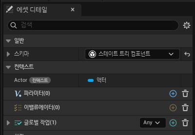
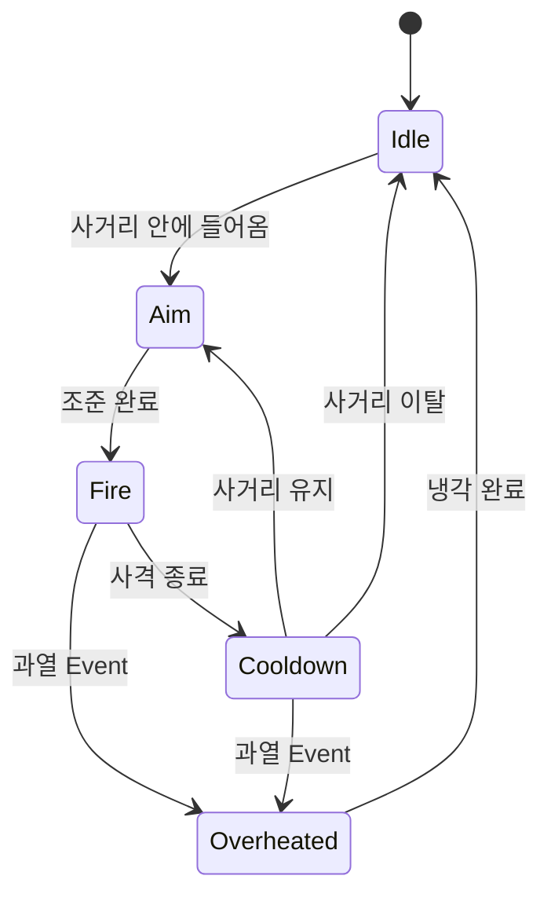
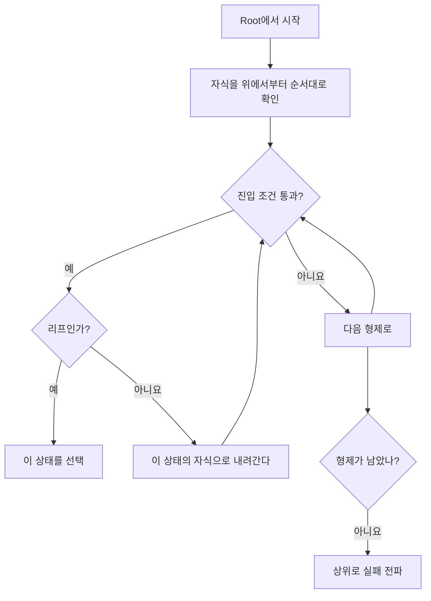
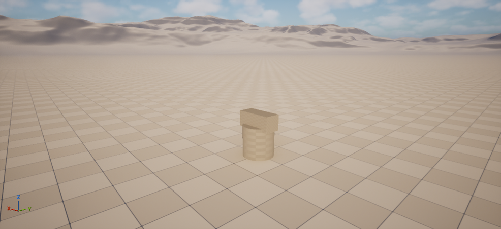
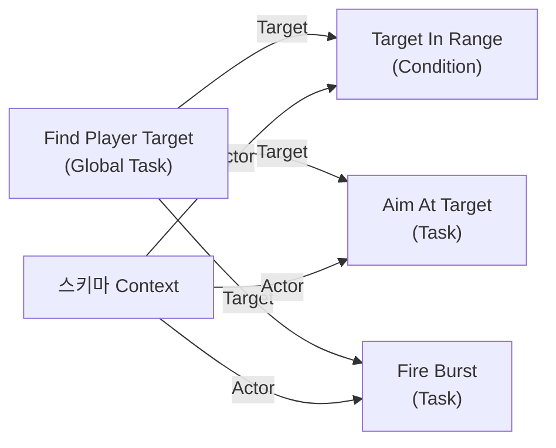
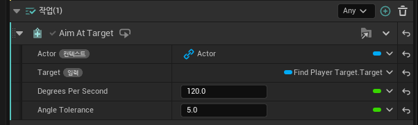
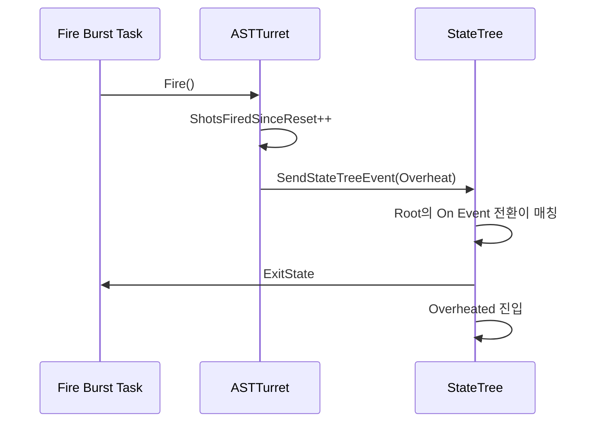
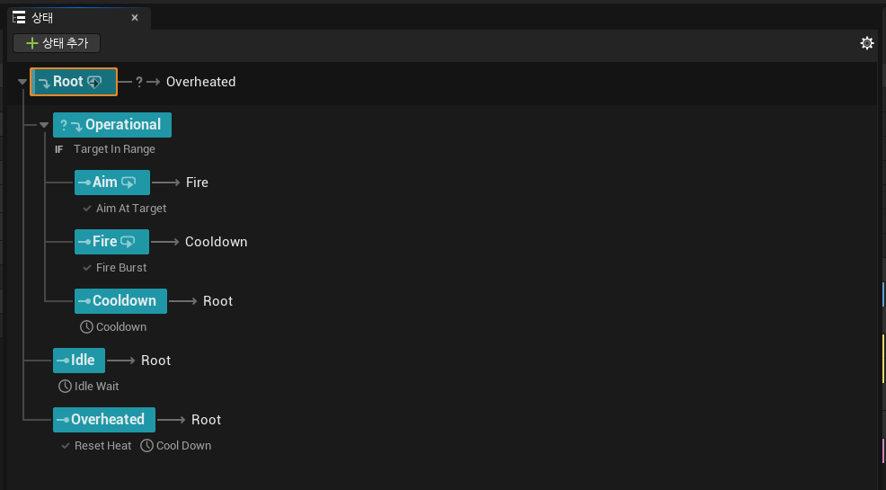
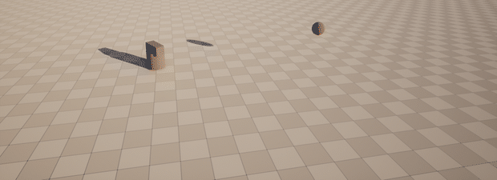

# StateTree로 터렛 만들기

<a id="contents"></a>

## 목차

1. [StateTree는 어디에 있는가](#position)
2. [준비 - 플러그인과 모듈](#setup)
3. [용어 정리](#terms)
4. [스키마를 먼저 정한다](#schema)
5. [만들 것 - 터렛의 상태](#turret-states)
6. [상태 선택과 전환이 도는 방식](#flow)
7. [액터는 몸만 담당한다](#actor)
8. [Task를 C++로 만들기](#task)
9. [Condition과 Global Task](#condition-global)
10. [Blackboard가 없는 대신](#binding)
11. [Event로 상태를 바꾸기](#event)
12. [에디터에서 조립하기](#editor)
13. [돌려 보기](#run)
14. [Behavior Tree와 무엇이 다른가](#vs-bt)
15. [막히기 쉬운 곳](#pitfalls)
16. [정리](#summary)

---

이 문서는 Unreal Engine 5.8 기준이다. 코드는 `Source/UnrealEngineLab/StateTreeLab/`, 에셋은 `Content/AI/ST_Turret` 에 있다. 설명을 위해 일부 선언은 생략했다.

개념과 용어는 Epic의 [Your First 60 Minutes with StateTree](https://dev.epicgames.com/community/learning/tutorials/lwnR/unreal-engine-your-first-60-minutes-with-statetree) 를 따랐다. 그쪽은 AI 컨트롤러와 Perception으로 야생동물 AI를 만들고, 여기서는 컨트롤러 없이 제자리에서 도는 터렛을 만든다.

---

<a id="position"></a>

## 1. StateTree는 어디에 있는가

[FSM과 State Pattern](../CS/FSMStatePattern.md) 에서 상태가 늘어나면 `enum + switch` 에서 State Pattern으로, 계층과 조건이 복잡해지면 StateTree를 검토한다고 정리했다. 이 문서는 그 마지막 칸을 실제로 채워 본 기록이다.

StateTree는 이름과 달리 AI 전용이 아니다. Epic도 격투게임 커맨드 판정, 애니메이션 선택, 퀘스트 로직을 예로 든다. 엔진에서의 위치는 이렇다.

```text
StateTree           범용 계층형 상태 머신. 액터, UI, 게임 모드 어디든 붙는다.
GameplayStateTree   그 위에 Component와 AI용 Task를 얹은 플러그인.
```

그래서 처음 볼 때 AI부터 시작하면 손해다. NavMesh, Perception, EQS가 같이 딸려오면서 정작 StateTree 자체가 안 보인다. 터렛처럼 제자리에서 도는 액터가 학습 대상으로 좋은 이유가 이것이다. 이동이 없으니 남는 건 상태와 전환뿐이다.

---

<a id="setup"></a>

## 2. 준비 - 플러그인과 모듈

플러그인 두 개를 켠다. `GameplayStateTree` 를 켜면 `StateTree` 는 의존성으로 따라오지만, 무엇을 쓰는지 드러나도록 둘 다 적었다. 둘 다 production ready 로 표시된 플러그인이다.

```json
{
    "Name": "StateTree",
    "Enabled": true
},
{
    "Name": "GameplayStateTree",
    "Enabled": true
}
```

C++로 노드를 만들려면 모듈 의존성도 추가한다.

```csharp
PublicDependencyModuleNames.AddRange(new string[] {
    "Core", "CoreUObject", "Engine",
    "GameplayTags",             // Event 태그
    "StateTreeModule",          // Task / Condition 베이스
    "GameplayStateTreeModule"   // UStateTreeComponent
});
```

`StateTreeEditorModule` 은 에디터 전용이라 런타임 모듈에서 참조하지 않는다. 노드를 에디터 목록에 노출하는 일은 리플렉션이 알아서 한다.

---

<a id="terms"></a>

## 3. 용어 정리

StateTree는 용어를 먼저 맞추지 않으면 문서를 읽어도 겉돈다. 자주 나오는 것만 추렸다.

| 용어 | 의미 |
| --- | --- |
| Schema | 이 트리가 무엇에 붙는지 정한다. Context를 제공하고, 쓸 수 있는 노드를 제한한다 |
| Context | 스키마가 제공하는 데이터. 모든 Task와 Condition이 바인딩해서 쓸 수 있다 |
| Parameters | 사용자가 정의하는 추가 데이터. 에셋을 붙이는 쪽에서 값을 덮어쓸 수 있다 |
| State | 자식 상태, Task, 진입 조건, 전환을 담는 조직 단위 |
| Task | 상태가 활성인 동안 실행되는 로직 |
| Global Task | 트리가 살아 있는 동안 계속 실행되는 Task |
| Evaluator | Global Task와 같은 자리. Epic이 Global Task로 정리하는 중이라 새로 쓸 이유는 없다 |
| Condition | 진입 조건이나 전환 조건에 들어가는 `bool` 판정 |
| Transition | 언제 어디로 상태를 바꿀지에 대한 규칙 |
| Property Reference | Blackboard 키처럼 파라미터에 값을 되쓰기 위한 참조 |

State에는 타입도 있다.

| 타입 | 설명 |
| --- | --- |
| State | 기본 상태 |
| Group | Task를 가질 수 없다. 자식과 조건, 전환만 가진다 |
| Linked | 같은 에셋 안의 Subtree로 연결한다 |
| Linked Asset | 다른 StateTree 에셋을 통째로 실행한다 |
| Subtree | Linked가 가리키는 대상이 되는 상태 |

이 문서의 터렛은 전부 기본 `State` 만 쓴다.

---

<a id="schema"></a>

## 4. 스키마를 먼저 정한다

StateTree 에셋을 만들면 가장 먼저 스키마를 묻는다. 스키마는 **이 트리가 무엇에 붙는지**를 정하는 값이고, 두 가지가 따라온다.

| 스키마 | 붙는 대상 | Context |
| --- | --- | --- |
| StateTree Component | `UStateTreeComponent` 를 가진 아무 액터 | `Actor` |
| StateTree AI Component | AIController + Pawn | `AIController`, `Actor` |

터렛은 앞의 것을 쓴다.



스키마는 노드 목록도 함께 거른다. `UStateTreeComponentSchema::IsStructAllowed()` 를 통과하지 못한 Task는 에디터의 추가 목록에 **아예 나타나지 않는다**. 만든 노드가 안 보이면 코드가 아니라 스키마를 먼저 의심하면 된다.

Context는 트리가 밖에서 받아오는 값이다. 컴포넌트 스키마의 Context는 `Actor` 하나뿐이고, 노드의 인스턴스 데이터에 이런 프로퍼티를 두면 에디터가 알아서 연결해 준다.

```cpp
UPROPERTY(EditAnywhere, Category = "Context")
TObjectPtr<AActor> Actor = nullptr;
```

연결은 타입으로 먼저 맞추고, 후보가 여럿이면 이름이 가까운 쪽을 고른다.

한 가지 함정이 있다. StateTree Component 스키마는 BrainComponent에 AI 컨트롤러가 있고 그 컨트롤러가 `Context Actor Class` 를 만족하면, `Actor` Context를 **폰이 아니라 컨트롤러에** 연결한다. 클래스를 좁혀 두면 이런 오해를 막을 수 있다.

---

<a id="turret-states"></a>

## 5. 만들 것 - 터렛의 상태

플레이어가 사거리에 들어오면 조준하고, 몇 발 쏘고, 식힌다. 너무 많이 쏘면 과열되어 잠시 멈춘다.



이걸 StateTree의 계층으로 옮기면 이렇게 된다.

```text
Root
├─ Operational                     진입 조건: 대상이 사거리 안
│   ├─ Aim                         Aim At Target
│   ├─ Fire                        Fire Burst
│   └─ Cooldown                    Delay
├─ Idle                            Delay
└─ Overheated                      Reset Heat + Delay
```

`Operational` 을 부모로 둔 이유가 StateTree를 쓰는 이유이기도 하다. "사거리 안에 있어야 한다"는 조건이 세 상태 각각에 붙는 대신 부모 한 곳에만 붙는다.

`Idle` 이 `Operational` 밖에 있는 것도 이유가 있다. `Root` 는 자식을 위에서부터 순서대로 시도하면서 진입 조건을 만족하는 첫 번째를 고른다.

```text
Operational   조건 있음   사거리 안일 때만 선택된다
Idle          조건 없음   항상 선택된다. 사실상 폴백이다
Overheated    조건 없음   Idle 에서 이미 걸리므로 선택으로는 도달하지 않는다
```

`Overheated` 를 맨 아래 둔 것이 이 순서를 이용한 것이다. 일반 선택으로는 절대 닿지 않고, 오직 이벤트 전환으로만 들어간다.

---

<a id="flow"></a>

## 6. 상태 선택과 전환이 도는 방식

여기를 이해하면 나머지는 대부분 따라온다.

### 상태 선택

선택은 루트에서 시작하는 깊이 우선 탐색이다.



중요한 규칙 세 가지다.

```text
기본값에서 StateTree는 리프 상태에만 들어간다.
중간 상태에서 멈추려면 선택 비헤이비어를 Try Enter 로 바꿔야 한다.

모든 자식이 진입에 실패하면 트리는 Tree Failed 로 멈춘다.

상태가 바뀔 때 나가는 순서는 리프에서 루트, 들어가는 순서는 루트에서 리프다.
그리고 이전 상태와 새 상태의 공통 조상까지만 빠져나온다.
```

선택 비헤이비어는 상태마다 지정한다.

| 값 | 동작 |
| --- | --- |
| Try Enter | 진입 조건만 통과하면 자식이 있어도 이 상태에 들어간다 |
| Try Select Children In Order | 기본값. 자식을 위에서부터 시도한다 |
| Try Select Children At Random | 자식 순서를 섞어서 시도한다 |
| Try Select Children With Highest Utility | 유틸리티 점수가 가장 높은 자식 |
| Try Select Children At Random Weighted By Utility | 점수를 가중치로 삼아 무작위 선택 |
| Try Follow Transitions | 들어가는 대신 이 상태의 전환을 따라간다 |
| None | 직접 선택될 수 없다 |

### 전환

Task가 끝나거나 이벤트가 오면 전환 판정이 시작된다. 판정은 **리프에서 루트 방향으로** 올라가고, 처음 성공한 전환이 채택된다. 그래서 공통 전환은 중간 상태에 한 번만 두면 된다.

여기에 놓치기 쉬운 규칙이 있다.

```text
활성 상태 중 어느 하나의 Task라도 끝나면 전환 판정이 돈다.
성공이든 실패든 상관없다.
```

Task가 값을 하나 구해 놓는 역할만 한다면 `Succeeded` 를 돌려주면 안 된다. 이동이 끝나기도 전에 상태가 넘어가 버린다. 5.6부터는 Task마다 "완료 판정에 포함할지"를 켜고 끌 수 있고, 상태마다 완료 방식도 고를 수 있다.

| Tasks Completion | 의미 |
| --- | --- |
| Any | 기본값. 완료 판정 대상 Task 중 하나가 끝나면 상태가 끝난다 |
| All | 대상 Task가 전부 성공해야 끝난다. 하나라도 실패하면 실패로 끝난다 |

에디터에서는 Task 이름 왼쪽의 클립보드 아이콘으로 완료 판정 포함 여부를 토글한다. 파란색이 포함, 회색이 제외다. `Debug Text Task` 처럼 아예 토글이 막혀 있는 것도 있다.

---

<a id="actor"></a>

## 7. 액터는 몸만 담당한다

터렛 액터에는 상태 판단이 없다. 머리를 돌리고, 쏘고, 몇 발 쐈는지 세는 것이 전부다.

```cpp
UCLASS()
class UNREALENGINELAB_API ASTTurret : public AActor
{
    GENERATED_BODY()

public:
    /** 머리를 목표 쪽으로 회전시키고, 회전 후 남은 각도(도)를 돌려준다. */
    float RotateHeadTowards(const FVector& TargetLocation, float DeltaSeconds, float DegreesPerSecond);

    /** 총구에서 목표까지 디버그 라인을 그린다. 과열 카운트도 여기서 올라간다. */
    void Fire(const FVector& TargetLocation);

    void SendTurretEvent(FGameplayTag EventTag);
    void ResetHeat();

private:
    TObjectPtr<UStateTreeComponent> StateTreeComponent;
    int32 ShotsFiredSinceReset = 0;
};
```

`RotateHeadTowards()` 가 회전만 하지 않고 **남은 각도를 돌려주는** 점이 중요하다. "조준이 끝났는가"를 판단하는 것은 액터가 아니라 Task이고, 액터는 판단에 필요한 값만 넘긴다.

컴포넌트는 생성자에서 붙인다.

```cpp
StateTreeComponent = CreateDefaultSubobject<UStateTreeComponent>(TEXT("StateTreeComponent"));
```

`UStateTreeComponent` 는 `UBrainComponent` 를 상속한다. `bStartLogicAutomatically` 가 기본 `true` 라서 BeginPlay에 알아서 돌기 시작한다. 직접 켜고 끄려면 이 값을 꺼야 한다.



---

<a id="task"></a>

## 8. Task를 C++로 만들기

StateTree의 Task는 `UObject` 가 아니라 `USTRUCT` 다. 그리고 노드와 실행 데이터가 분리되어 있다.

```cpp
// 실행 중에 바뀌는 값은 전부 여기 들어간다.
USTRUCT()
struct FSTAimAtTargetTaskInstanceData
{
    GENERATED_BODY()

    UPROPERTY(EditAnywhere, Category = "Context")
    TObjectPtr<AActor> Actor = nullptr;

    UPROPERTY(EditAnywhere, Category = "Input")
    TObjectPtr<AActor> Target = nullptr;

    UPROPERTY(EditAnywhere, Category = "Parameter", meta = (ClampMin = "1.0"))
    float DegreesPerSecond = 120.f;

    UPROPERTY(EditAnywhere, Category = "Parameter", meta = (ClampMin = "0.1"))
    float AngleTolerance = 5.f;
};

USTRUCT(meta = (DisplayName = "Aim At Target", Category = "Turret"))
struct FSTAimAtTargetTask : public FStateTreeTaskCommonBase
{
    GENERATED_BODY()

    using FInstanceDataType = FSTAimAtTargetTaskInstanceData;

    virtual const UStruct* GetInstanceDataType() const override
    {
        return FInstanceDataType::StaticStruct();
    }

    virtual EStateTreeRunStatus Tick(FStateTreeExecutionContext& Context, const float DeltaTime) const override;
};
```

구현은 이렇다.

```cpp
EStateTreeRunStatus FSTAimAtTargetTask::Tick(FStateTreeExecutionContext& Context, const float DeltaTime) const
{
    const FInstanceDataType& InstanceData = Context.GetInstanceData(*this);

    ASTTurret* Turret = Cast<ASTTurret>(InstanceData.Actor);
    if (!Turret || !InstanceData.Target)
    {
        return EStateTreeRunStatus::Failed;
    }

    const float RemainingAngle = Turret->RotateHeadTowards(
        InstanceData.Target->GetActorLocation(),
        DeltaTime,
        InstanceData.DegreesPerSecond);

    return RemainingAngle <= InstanceData.AngleTolerance
        ? EStateTreeRunStatus::Succeeded
        : EStateTreeRunStatus::Running;
}
```

여기서 눈여겨볼 것은 `Tick()` 이 **`const`** 라는 점이다. `EnterState()`, `ExitState()` 도 전부 `const` 다.

```text
FSTAimAtTargetTask             에셋에 한 벌만 존재한다. 모든 터렛이 공유한다.
FSTAimAtTargetTaskInstanceData 터렛마다 하나씩 생긴다.
```

Task 구조체의 멤버에 실행 중 값을 쓰면 모든 터렛이 그 값을 나눠 쓰게 된다. `const` 는 그걸 컴파일 단계에서 막는 장치다. Behavior Tree의 Node Memory와 같은 개념인데, 여기서는 타입 시스템이 강제한다.

[State Pattern 문서](../CS/FSMStatePattern.md#state-context) 에서 "여러 몬스터가 하나의 State 객체를 공유하면서 개별 실행 데이터를 저장하면 값이 섞인다"고 적었던 그 문제다. StateTree는 그 실수를 할 수 없게 만들어 두었다.

상태에 다시 들어올 때 초기화가 필요하면 `EnterState()` 에서 한다.

```cpp
EStateTreeRunStatus FSTFireTask::EnterState(FStateTreeExecutionContext& Context, const FStateTreeTransitionResult& Transition) const
{
    FInstanceDataType& InstanceData = Context.GetInstanceData(*this);

    // 이 두 줄이 없으면 두 번째 사격이 즉시 끝난다.
    InstanceData.ShotsFired = 0;
    InstanceData.TimeSinceLastShot = InstanceData.Interval;

    return EStateTreeRunStatus::Running;
}
```

Tick이 필요 없는 Task는 생성자에서 꺼 둔다. 매 프레임 호출과 바인딩 프로퍼티 복사가 함께 사라진다.

```cpp
FSTResetHeatTask::FSTResetHeatTask()
{
    bShouldCallTick = false;
}
```

---

<a id="condition-global"></a>

## 9. Condition과 Global Task

Condition은 `bool` 하나를 돌려준다.

```cpp
bool FSTTargetInRangeCondition::TestCondition(FStateTreeExecutionContext& Context) const
{
    const FInstanceDataType& InstanceData = Context.GetInstanceData(*this);

    bool bResult = false;
    if (InstanceData.Actor && InstanceData.Target)
    {
        const float DistanceSquared = FVector::DistSquared(
            InstanceData.Actor->GetActorLocation(),
            InstanceData.Target->GetActorLocation());

        bResult = DistanceSquared <= FMath::Square(InstanceData.Range);
    }

    return bResult ^ bInvert;
}
```

같은 노드가 두 자리에 들어간다는 점이 편하다.

```text
진입 조건 자리   이 상태에 들어갈 수 있는가
전환 조건 자리   이 상태에서 나가야 하는가
```

대상을 찾아 트리 전체에 공급하는 일은 **Global Task**가 맡는다. 상태와 무관하게 트리가 살아 있는 동안 계속 돈다.

```cpp
EStateTreeRunStatus FSTFindTargetTask::Tick(FStateTreeExecutionContext& Context, const float DeltaTime) const
{
    FInstanceDataType& InstanceData = Context.GetInstanceData(*this);
    InstanceData.Target = UGameplayStatics::GetPlayerPawn(Context.GetWorld(), 0);

    // Running 을 유지해야 트리가 계속 돈다.
    return EStateTreeRunStatus::Running;
}
```

같은 자리에 **Evaluator**를 넣을 수도 있다. 예전에는 이런 값 공급을 Evaluator가 맡았는데, Epic은 Global Task로 정리하는 중이라고 밝혔다. 둘 다 동작하지만 새로 만들 때 Evaluator를 고를 이유는 없다.

Global Task에서 `Succeeded` 를 돌려주면 안 된다는 점이 중요하다. [6절](#flow)에서 본 것처럼 활성 상태의 Task가 하나라도 끝나면 전환 판정이 도는데, 글로벌 Task가 끝나면 트리 전체가 끝나 버린다.

`Target` 프로퍼티의 카테고리는 `Output` 이다. 이 이름표가 에디터에서 "다른 노드가 바인딩해 갈 수 있는 값"이라는 뜻이 된다.

| 카테고리 | 의미 |
| --- | --- |
| `Context` | 스키마가 채워 주는 값. 자동 연결되고, 원하면 다른 값으로 덮어쓸 수 있다 |
| `Input` | 다른 노드에서 바인딩해 오는 값. **바인딩이 없으면 컴파일이 실패한다** |
| `Parameter` | 에디터에서 직접 적는 값. 바인딩도 선택적으로 가능하다 |
| `Output` | 이 노드가 내보내는 값 |

---

<a id="binding"></a>

## 10. Blackboard가 없는 대신

Behavior Tree에서 `Target` 은 Blackboard 키였다. 누가 쓰고 누가 채우는지는 그래프에 안 나오고, 이름을 잘못 적으면 실행 중에 조용히 비어 있었다.

StateTree에는 Blackboard가 없다. 값은 노드에서 노드로 직접 연결한다.



에디터에서는 이렇게 보인다.



`Actor` 는 컨텍스트라 자동으로 연결됐고, `Target` 은 Global Task의 출력에 직접 걸었다. `Degrees Per Second` 와 `Angle Tolerance` 는 값을 그대로 적었다.

차이는 두 가지다.

```text
Blackboard
전역 딕셔너리. 이름으로 찾는다. 의존성이 그래프에 안 보인다.

Property Binding
값을 만든 노드와 쓰는 노드가 직접 연결된다. 타입이 맞아야 연결된다.
```

의존성이 이름 대신 연결로 드러난다는 점은 [아키텍처와 의존성](../CS/ArchitectureDependencies.md) 에서 이야기한 것과 같은 방향이다. 다만 공짜는 아니다. 값을 쓰는 노드가 늘어나면 연결선도 같이 늘어난다. 여러 상태가 공유하는 값이라면 부모 상태의 Parameter로 한 번 올려 두고 자식이 거기에 바인딩하는 편이 낫다.

반대 방향으로 값을 되쓰려면 Property Reference를 쓴다. Blackboard 키에 값을 써 넣던 패턴에 대응하는 자리다.

---

<a id="event"></a>

## 11. Event로 상태를 바꾸기

과열은 밖에서 들어오는 신호다. 매 프레임 "과열됐나?"를 묻는 대신, 과열된 순간에만 알린다.

태그는 네이티브로 선언했다.

```cpp
// STTurret.h
UNREALENGINELAB_API UE_DECLARE_GAMEPLAY_TAG_EXTERN(TAG_StateTree_Turret_Overheat);

// STTurret.cpp
UE_DEFINE_GAMEPLAY_TAG(TAG_StateTree_Turret_Overheat, "StateTree.Turret.Overheat");
```

보내는 쪽은 액터다.

```cpp
void ASTTurret::Fire(const FVector& TargetLocation)
{
    DrawDebugLine(GetWorld(), GetMuzzleLocation(), TargetLocation, FColor::Orange, false, 0.35f, 0, 3.f);

    ++ShotsFiredSinceReset;

    // 과열 판단은 액터가 하지만, 그래서 어떤 상태로 갈지는 StateTree가 정한다.
    if (ShotsFiredSinceReset >= ShotsUntilOverheat)
    {
        SendTurretEvent(TAG_StateTree_Turret_Overheat);
    }
}

void ASTTurret::SendTurretEvent(FGameplayTag EventTag)
{
    StateTreeComponent->SendStateTreeEvent(FStateTreeEvent(EventTag));
}
```

받는 쪽은 트리다. `Root` 에 `On Event` 전환을 하나 두고 태그를 지정하면 끝이다.



전환은 리프에서 루트로 올라가며 판정되므로, 자식 어디에 있든 `Root` 의 이 전환 하나가 받아 준다. 자식마다 같은 전환을 복사할 필요가 없다.

액터는 "몇 발 쐈는지"만 알고, 그래서 어디로 가야 하는지는 모른다. 이 경계가 유지되면 상태를 하나 더 끼워 넣을 때 액터 코드를 건드리지 않아도 된다.

---

<a id="editor"></a>

## 12. 에디터에서 조립하기

C++ 쪽이 준비되면 나머지는 에디터에서 만든다.

```text
1  콘텐츠 브라우저 > 추가 > 인공 지능 > 스테이트 트리
2  스키마로 StateTree Component 선택
3  에셋을 열고 Root 아래에 Operational / Idle / Overheated 추가
4  Operational 아래에 Aim / Fire / Cooldown 추가
5  에셋 디테일의 글로벌 작업에 Find Player Target 추가
6  각 상태에 Task를 넣고, Target을 Global Task 출력에 바인딩
7  Operational의 진입 조건에 Target In Range
8  전환을 연결하고 툴바의 컴파일
9  터렛 액터의 StateTree Component에 이 에셋을 지정
```

상태는 `+ 상태 추가` 버튼이나 우클릭 메뉴로 만든다. 드래그로 순서와 깊이를 바꿀 수 있는데, 가는 파란 선이 뜨면 순서 변경이고 파란 상자가 뜨면 그 상태의 자식으로 들어간다.

완성된 모습이다.



상태 오른쪽에 붙는 이름이 전환 대상이다. `Aim → Fire`, `Fire → Cooldown` 은 `On State Completed` 전환이라 조건을 따로 적지 않았다. Task가 `Succeeded` 를 돌려주면 그대로 다음 상태로 넘어간다.

`Cooldown`, `Idle`, `Overheated` 는 모두 `Root` 로 돌아간다. 상태 선택이 루트에서 다시 내려오면서 `Operational` 의 진입 조건을 새로 확인하게 만들려는 것이다. 진입 조건은 **선택 시점에만** 평가되기 때문에, 한 사이클이 끝날 때마다 루트로 올려보내지 않으면 사거리를 벗어나도 계속 쏘게 된다.

`Root` 옆의 `? → Overheated` 가 이벤트 전환이다.

한 가지 알아 둘 것은, 전환을 하나도 안 걸어도 리프 상태에는 **Root로 돌아가는 암묵적 전환**이 붙어 있다는 점이다. 트리가 한 가지에 갇히는 것을 막기 위한 장치이고, 조건 없는 전환을 직접 추가하면 사라진다. 처음에 트리를 만들면 모든 리프가 "Root"를 가리키고 있는 이유가 이것이다.

---

<a id="run"></a>

## 13. 돌려 보기

PIE로 돌린 결과다. 플레이어를 터렛 주위로 움직이면 머리가 따라오고, 조준이 끝나면 사격한다. 주황색 선이 `Fire Burst` 가 그리는 디버그 라인이다.



눈으로만 보면 애매하니 수치로도 확인했다. 터렛은 (600, 0)에 있다.

| 플레이어 위치 | 머리 Yaw | 계산값 |
| --- | --- | --- |
| (-450, -250) | -166.6도 | `atan2(-250, -1050)` = -166.6도 |
| 사거리 밖(약 2600)으로 이동 | -166.6도 그대로 | 추적 중단. `Idle` 로 떨어졌다 |
| 사거리 안(약 900)으로 복귀 | 91.7도 | 90도. `Angle Tolerance` 5도 안쪽 |

조준 → 사격 → 대기 → 재선택 루프와, 사거리 이탈 시 이탈이 모두 의도대로 돈다.

실행 중에 트리 상태를 보려면 Gameplay Debugger가 편하다. 현재 활성 상태와 실행 중인 Task 목록을 그대로 띄워 준다.

---

<a id="vs-bt"></a>

## 14. Behavior Tree와 무엇이 다른가

| | Behavior Tree | StateTree |
| --- | --- | --- |
| 실행 | 매 틱 루트부터 재탐색 | 활성 상태 유지, 전환 시에만 재선택 |
| 데이터 | Blackboard | Parameter + Property Binding |
| 분기 | Decorator, Service | 진입 조건, 전환 |
| 신호 | Blackboard 폴링 | Event (GameplayTag) |
| 상태 개념 | 없음. 매번 다시 고른다 | 있음. 들어가고 나온다 |

가장 큰 차이는 마지막 줄이다. Behavior Tree는 상태를 갖지 않고 매 틱 어떤 행동을 할지 다시 고른다. StateTree는 상태에 머물러 있다가 전환 조건이 맞을 때만 옮긴다.

그래서 StateTree가 항상 더 좋은 것은 아니다.

```text
매 틱 우선순위를 다시 따져야 한다         Behavior Tree
상태에 머물면서 진입/이탈 처리가 필요하다   StateTree
```

---

<a id="pitfalls"></a>

## 15. 막히기 쉬운 곳

**만든 노드가 목록에 없다**
스키마가 거른 것이다. 노드 코드가 아니라 에셋의 스키마를 먼저 본다.

**Task 멤버에 상태를 저장했다**
컴파일이 안 된다. 콜백이 전부 `const` 이기 때문이다. 값은 InstanceData로 옮긴다.

**Input 프로퍼티인데 컴파일이 실패한다**
`Input` 카테고리는 바인딩이 **필수**다. 선택적으로 두려면 `Parameter` 로 바꾸거나 Optional 메타를 붙인다.

**두 번째 진입부터 Task가 즉시 끝난다**
`EnterState()` 에서 카운터를 초기화하지 않았을 때 생긴다.

**값만 구해 오는 Task를 만들었는데 상태가 바로 넘어간다**
그 Task가 `Succeeded` 를 돌려주고 있는 것이다. 활성 상태의 Task가 하나라도 끝나면 전환 판정이 돈다. 계속 머물러야 한다면 `Running` 을 유지하거나, 완료 판정 대상에서 빼야 한다.

**진입 조건이 항상 실패한다**
그 조건이 상위 상태 Task의 출력에 의존하고 있지 않은지 본다. StateTree는 진입 조건을 평가하려고 선행 Task를 미리 실행해 주지 않는다.

**C++에서 노드를 바꿨는데 반영이 안 된다**
에셋을 열고 컴파일을 눌러야 한다. 환경설정의 `Save On Compile` 은 기본이 `Never` 라서 컴파일과 저장은 별개다.

**BP Task에서 반환값이 안 보인다**
5.8에서 `EnterState` / `Tick` 의 반환값 방식은 deprecated 됐다. 이제 `Finish Task` 노드로 완료를 알린다. 예전 자료를 볼 때 어긋나는 지점이다.

---

<a id="summary"></a>

## 16. 정리

```text
스키마
트리가 무엇에 붙는지 정한다. 사용할 수 있는 노드도 여기서 갈린다.

State
계층으로 쌓는다. 공통 조건은 부모에 한 번만 적는다.
선택은 루트에서 리프로, 전환 판정은 리프에서 루트로 간다.

Task
USTRUCT이고 콜백이 const다. 실행 값은 InstanceData에 둔다.
끝났다고 알리는 순간 전환이 돈다는 점을 항상 염두에 둔다.

Condition / Global Task
판단과 값 공급을 나눈다. Blackboard 자리를 대신한다.

Event
밖에서 들어오는 신호. 폴링 대신 쓴다.
```

터렛 하나를 만들어 보면 StateTree가 Behavior Tree의 상위 호환이 아니라는 게 분명해진다. 상태에 머무는 동작을 다루는 도구이고, 그 대신 매 틱 우선순위를 다시 따지는 일은 잘 못한다.

무엇을 쓰든 확인할 것은 [FSM 문서](../CS/FSMStatePattern.md#summary) 와 같다. 현재 상태와 전환 조건을 쉽게 찾을 수 있고, 상태가 바뀔 때 진입과 이탈이 예측 가능한 순서로 실행되면 된다. StateTree는 그 두 가지를 에디터에서 눈으로 확인할 수 있게 해 주는 쪽에 가깝다.

---

### 참고

- [Your First 60 Minutes with StateTree](https://dev.epicgames.com/community/learning/tutorials/lwnR/unreal-engine-your-first-60-minutes-with-statetree) - Epic Developer Community
- [Overview of StateTree in Unreal Engine](https://dev.epicgames.com/documentation/en-us/unreal-engine/overview-of-state-tree-in-unreal-engine) - 공식 문서

---

[목차로 돌아가기](#contents) · [메인 README의 Unreal Engine 목차로 돌아가기](../../README.md#unreal-engine)
